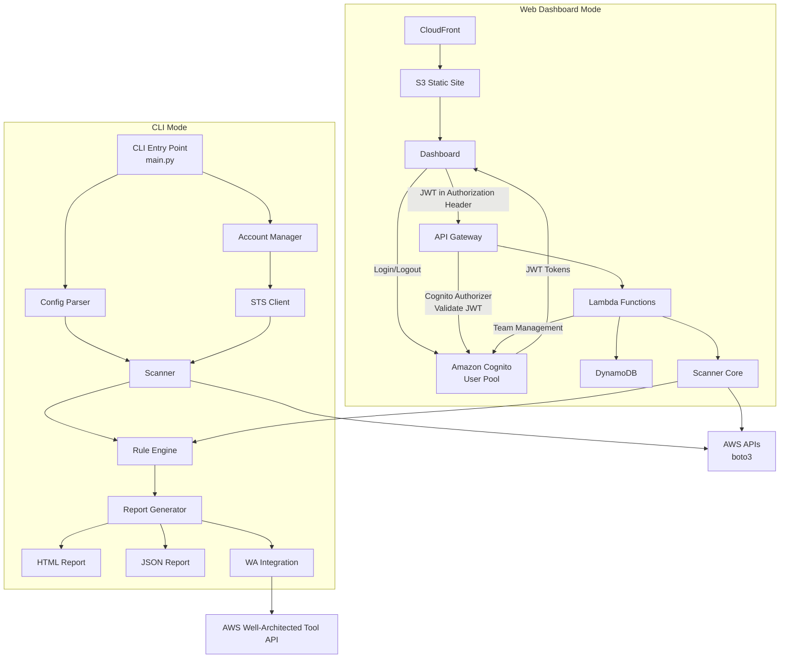
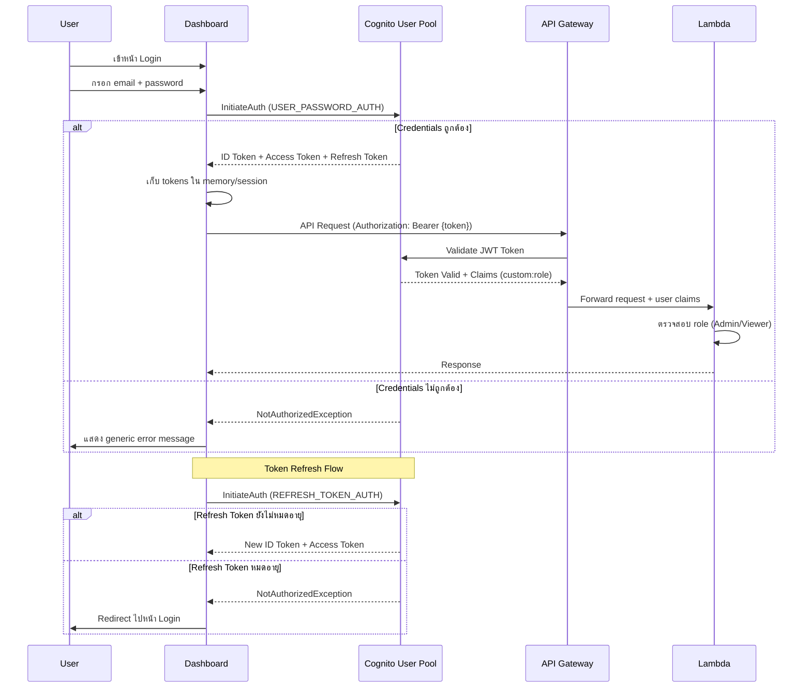
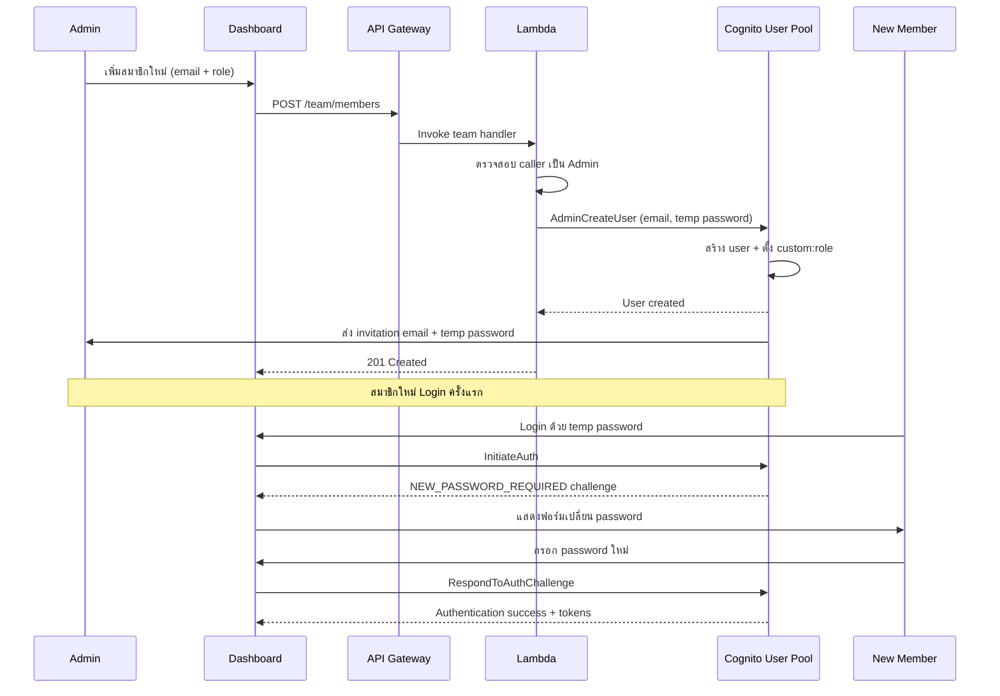
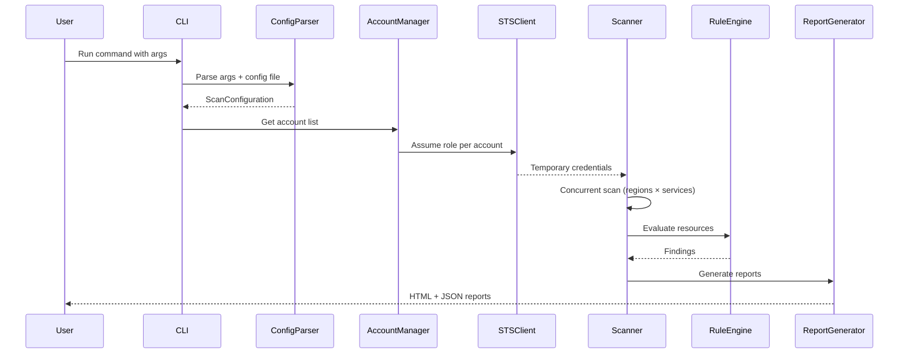
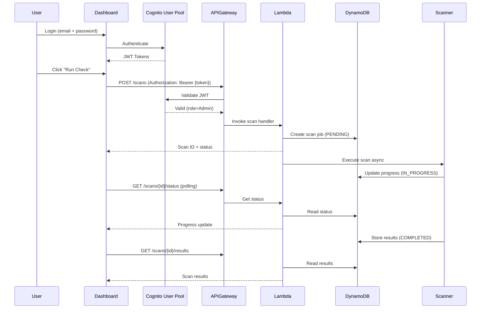

# Design Document: AWS Well-Architected Review Tool

## Overview

AWS Well-Architected Review Tool เป็นเครื่องมืออัตโนมัติที่พัฒนาด้วย Python สำหรับตรวจสอบและประเมิน AWS environment ตาม 5 เสาหลักของ AWS Well-Architected Framework ระบบประกอบด้วย 2 โหมดการทำงานหลัก:

1. **CLI Mode**: เครื่องมือ command-line ที่ทำงานบน AWS CloudShell หรือ local environment สำหรับสแกน resources, ประเมินตามกฎ, และสร้างรายงาน HTML/JSON
2. **Web Dashboard Mode**: web application แบบ serverless ที่ deploy บน CloudFront + S3 พร้อม backend บน API Gateway + Lambda + DynamoDB + Cognito สำหรับสแกนแบบ real-time ผ่าน browser พร้อมระบบ authentication และ team management

ระบบได้รับแรงบันดาลใจจาก [service-screener-v2](https://github.com/aws-samples/service-screener-v2) โดยใช้ boto3 เรียก AWS APIs เพื่อดึงข้อมูล resource configurations แล้วประเมินตามกฎที่กำหนดไว้ รองรับการสแกนข้ามหลาย regions, services, accounts และ tags

### Design Decisions

- **Python 3.12+**: เลือกใช้ Python เพื่อให้สอดคล้องกับ service-screener-v2 และรองรับ AWS CloudShell ที่มี Python ติดตั้งอยู่แล้ว
- **asyncio + ThreadPoolExecutor**: ใช้สำหรับ concurrent execution เพื่อลดเวลาสแกน โดย boto3 ไม่รองรับ async โดยตรงจึงใช้ ThreadPoolExecutor สำหรับ I/O-bound tasks
- **Plugin-based Rule Engine**: ออกแบบให้เพิ่ม checks ใหม่ได้โดยไม่ต้องแก้ไข core code ผ่าน structured configuration files
- **Pydantic v2**: ใช้สำหรับ data validation และ serialization ของ models ทั้งหมด
- **Vanilla HTML/CSS/JS**: ใช้สำหรับ Dashboard frontend — ไม่ต้องใช้ build tools หรือ framework ใดๆ สามารถ deploy เป็น static files ได้โดยตรง ใช้ Chart.js สำหรับ charts และ Amazon Cognito Identity JS SDK สำหรับ authentication
- **DynamoDB Single-Table Design**: ใช้ single table design pattern สำหรับ Data_Store เพื่อลด latency และ cost
- **Amazon Cognito User Pool**: ใช้สำหรับ authentication และ user management ของ web dashboard โดยจัดเก็บ user roles (Admin/Viewer) ใน custom attributes และใช้ Cognito Authorizer บน API Gateway สำหรับ JWT validation
- **AWS CDK (Python)**: ใช้สำหรับกำหนด infrastructure ทั้งหมดเป็น code (IaC) โดยสร้าง CDK stacks สำหรับ review ก่อน deploy จริง
- **Role-Based Access Control (RBAC)**: ใช้ 2 ระดับ (Admin, Viewer) โดย Admin สามารถจัดการทีมงาน, เริ่มสแกน, จัดการ accounts ส่วน Viewer สามารถดูรายงานเท่านั้น

## Architecture

### High-Level Architecture Diagram



### Authentication & Authorization Flow



### Team Management Flow



### Component Interaction Flow (CLI Mode)



### Component Interaction Flow (Web Dashboard Mode)



## Components and Interfaces

### 1. CLI Entry Point (`cli/main.py`)

จุดเริ่มต้นของ CLI mode ทำหน้าที่ parse command-line arguments และประสานงานการทำงานของ components ต่างๆ

```python
class CLIApp:
    def __init__(self):
        self.config_parser: ConfigParser
        self.account_manager: AccountManager
        self.scanner: Scanner
        self.report_generator: ReportGenerator

    def run(self, args: list[str]) -> int:
        """Run the CLI tool. Returns exit code (0, 1, or 2)."""
        ...

    def parse_arguments(self) -> argparse.Namespace:
        """Parse CLI arguments including subcommands for account management."""
        ...
```

**CLI Arguments**:
- `--regions`: รายการ regions (comma-separated)
- `--services`: รายการ services (comma-separated)
- `--tags`: tag filters (format: `Key=Value`)
- `--output-dir`: output directory path
- `--suppression-file`: path to suppression file
- `--concurrency`: จำนวน concurrent tasks สูงสุด (default: 10)
- `--verbosity`: log level (DEBUG, INFO, WARNING, ERROR)
- `--config`: path to configuration file (JSON/YAML)
- `--wa-integration`: enable Well-Architected Tool integration
- Subcommands: `add-account`, `remove-account`, `list-accounts`, `verify-account`

**Exit Codes**:
- `0`: สำเร็จ ไม่มี critical findings
- `1`: สำเร็จ มี critical findings
- `2`: execution error

### 2. Config Parser (`core/config_parser.py`)

อ่านและ validate scan configuration จาก CLI arguments และ configuration files

```python
class ConfigParser:
    def parse_cli_args(self, args: argparse.Namespace) -> ScanConfiguration:
        """Parse CLI arguments into ScanConfiguration."""
        ...

    def parse_config_file(self, file_path: str) -> ScanConfiguration:
        """Parse JSON or YAML configuration file."""
        ...

    def merge_configs(self, file_config: ScanConfiguration, cli_config: ScanConfiguration) -> ScanConfiguration:
        """Merge configs. CLI args take precedence over file config."""
        ...

    def parse_suppression_file(self, file_path: str) -> list[SuppressionRule]:
        """Parse suppression file and return list of rules."""
        ...

    def validate_config(self, config: ScanConfiguration) -> list[str]:
        """Validate configuration. Returns list of error messages."""
        ...
```

### 3. Account Manager (`core/account_manager.py`)

จัดการรายการ AWS accounts สำหรับ cross-account scanning

```python
class AccountManager:
    def __init__(self, storage_backend: AccountStorageBackend):
        self.storage: AccountStorageBackend
        self.sts_client: STSClient

    def add_account(self, account_id: str, role_arn: str, alias: str) -> AccountConfiguration:
        """Add new account. Validates ARN format and tests assume role."""
        ...

    def remove_account(self, identifier: str) -> bool:
        """Remove account by account_id or alias."""
        ...

    def update_account(self, account_id: str, role_arn: str | None, alias: str | None) -> AccountConfiguration:
        """Update account configuration."""
        ...

    def list_accounts(self) -> list[AccountConfiguration]:
        """List all registered accounts with connection status."""
        ...

    def verify_account(self, account_id: str) -> bool:
        """Test assume role connectivity for an account."""
        ...

    def get_credentials(self, account_id: str) -> dict:
        """Get temporary credentials via STS assume role."""
        ...
```

**Storage Backends**:
```python
class AccountStorageBackend(Protocol):
    def load(self) -> list[AccountConfiguration]: ...
    def save(self, accounts: list[AccountConfiguration]) -> None: ...

class FileAccountStorage(AccountStorageBackend):
    """JSON/YAML file storage for CLI mode."""
    ...

class DynamoDBAccountStorage(AccountStorageBackend):
    """DynamoDB storage for web dashboard mode."""
    ...
```

### 4. STS Client (`core/sts_client.py`)

จัดการ STS assume role และ credential refresh

```python
class STSClient:
    def __init__(self, session_duration: int = 3600):
        self.session_duration: int
        self._credentials_cache: dict[str, CachedCredentials]

    def assume_role(self, role_arn: str, session_name: str) -> dict:
        """Assume role and return temporary credentials."""
        ...

    def get_or_refresh_credentials(self, account_id: str, role_arn: str) -> dict:
        """Get cached credentials or refresh if expired."""
        ...

    def validate_role_arn(self, role_arn: str) -> bool:
        """Validate IAM role ARN format."""
        ...
```

### 5. Scanner (`core/scanner.py`)

ทำหน้าที่สแกน AWS resources แบบ concurrent

```python
class Scanner:
    def __init__(self, concurrency_limit: int = 10):
        self.concurrency_limit: int
        self.rule_engine: RuleEngine

    async def scan(self, config: ScanConfiguration, credentials_map: dict[str, dict]) -> ScanResult:
        """Execute scan across all accounts, regions, and services concurrently."""
        ...

    async def scan_service(self, service: str, region: str, credentials: dict) -> list[ResourceData]:
        """Scan a single service in a single region."""
        ...

    def filter_by_tags(self, resources: list[ResourceData], tag_filters: list[TagFilter]) -> list[ResourceData]:
        """Filter resources by tag conditions (AND logic)."""
        ...

    def apply_suppressions(self, findings: list[Finding], suppressions: list[SuppressionRule]) -> tuple[list[Finding], list[Finding]]:
        """Apply suppression rules. Returns (active_findings, suppressed_findings)."""
        ...
```

### 6. Rule Engine (`core/rule_engine.py`)

ประเมิน resources ตามกฎที่กำหนดและ map กับ Well-Architected pillars

```python
class RuleEngine:
    def __init__(self):
        self.checks: dict[str, Check]

    def load_checks(self, checks_dir: str) -> None:
        """Load check definitions from configuration files."""
        ...

    def evaluate(self, resource: ResourceData, service: str) -> list[Finding]:
        """Evaluate a resource against all applicable checks."""
        ...

    def get_checks_by_pillar(self, pillar: Pillar) -> list[Check]:
        """Get all checks for a specific pillar."""
        ...

    def get_checks_by_service(self, service: str) -> list[Check]:
        """Get all checks for a specific service."""
        ...
```

### 7. Report Generator (`core/report_generator.py`)

สร้างรายงานในรูปแบบ HTML และ JSON

```python
class ReportGenerator:
    def generate_html(self, scan_result: ScanResult, output_dir: str) -> str:
        """Generate self-contained HTML report. Returns file path."""
        ...

    def generate_json_raw(self, scan_result: ScanResult, output_dir: str) -> str:
        """Generate api-raw.json with raw findings data."""
        ...

    def generate_json_full(self, scan_result: ScanResult, output_dir: str) -> str:
        """Generate api-full.json with full report data."""
        ...
```

### 8. WA Integration (`core/wa_integration.py`)

เชื่อมต่อกับ AWS Well-Architected Tool API

```python
class WAIntegration:
    def create_workload(self, scan_result: ScanResult) -> str:
        """Create workload in WA Tool. Returns workload ID."""
        ...

    def create_milestone(self, workload_id: str, scan_result: ScanResult) -> str:
        """Create milestone with scan results."""
        ...

    def map_findings_to_questions(self, findings: list[Finding]) -> dict[str, list[str]]:
        """Map findings to WA Tool question IDs."""
        ...
```

### 9. Installer (`installer/install.sh`)

Script สำหรับติดตั้งผ่าน CloudShell ด้วยคำสั่งเดียว

```bash
# One-liner installation command:
# curl -sSL https://<bucket>.s3.amazonaws.com/install.sh | bash
```

**Installation Steps**:
1. ตรวจสอบ environment (CloudShell/Linux)
2. ตรวจสอบ Python version
3. ดาวน์โหลด source code
4. ติดตั้ง dependencies ด้วย pip (--user flag, ไม่ต้องใช้ sudo)
5. ตั้งค่า PATH
6. แสดงข้อความยืนยันพร้อมตัวอย่างคำสั่ง

### 10. API Backend (`backend/`)

Lambda functions สำหรับ web dashboard mode

```python
# backend/handlers/scan_handler.py
class ScanHandler:
    def start_scan(self, event: dict) -> dict:
        """POST /scans - Start new scan job. Requires Admin role."""
        ...

    def get_scan_status(self, event: dict) -> dict:
        """GET /scans/{id}/status - Get scan status and progress."""
        ...

    def get_scan_results(self, event: dict) -> dict:
        """GET /scans/{id}/results - Get scan results."""
        ...

    def list_scan_history(self, event: dict) -> dict:
        """GET /scans - List scan history."""
        ...

# backend/handlers/account_handler.py
class AccountHandler:
    def create_account(self, event: dict) -> dict:
        """POST /accounts - Add new account. Requires Admin role."""
        ...

    def delete_account(self, event: dict) -> dict:
        """DELETE /accounts/{id} - Remove account. Requires Admin role."""
        ...

    def update_account(self, event: dict) -> dict:
        """PUT /accounts/{id} - Update account. Requires Admin role."""
        ...

    def list_accounts(self, event: dict) -> dict:
        """GET /accounts - List all accounts."""
        ...

    def verify_account(self, event: dict) -> dict:
        """POST /accounts/{id}/verify - Verify account connectivity. Requires Admin role."""
        ...

# backend/handlers/team_handler.py
class TeamHandler:
    def add_member(self, event: dict) -> dict:
        """POST /team/members - Add new team member. Requires Admin role."""
        ...

    def remove_member(self, event: dict) -> dict:
        """DELETE /team/members/{email} - Remove team member. Requires Admin role."""
        ...

    def update_member_role(self, event: dict) -> dict:
        """PUT /team/members/{email}/role - Update member role. Requires Admin role."""
        ...

    def list_members(self, event: dict) -> dict:
        """GET /team/members - List all team members."""
        ...
```

**API Endpoints**:

| Method | Path | Description | Required Role |
|--------|------|-------------|---------------|
| POST | /scans | เริ่มการสแกนใหม่ | Admin |
| GET | /scans | ดูประวัติการสแกน | Admin, Viewer |
| GET | /scans/{id}/status | ดูสถานะการสแกน | Admin, Viewer |
| GET | /scans/{id}/results | ดูผลการสแกน | Admin, Viewer |
| POST | /accounts | เพิ่ม account | Admin |
| GET | /accounts | ดูรายการ accounts | Admin, Viewer |
| PUT | /accounts/{id} | แก้ไข account | Admin |
| DELETE | /accounts/{id} | ลบ account | Admin |
| POST | /accounts/{id}/verify | ตรวจสอบการเชื่อมต่อ | Admin |
| POST | /team/members | เพิ่มสมาชิกในทีม | Admin |
| GET | /team/members | ดูรายการสมาชิก | Admin |
| PUT | /team/members/{email}/role | เปลี่ยน role สมาชิก | Admin |
| DELETE | /team/members/{email} | ลบสมาชิก | Admin |

### 11. Auth Module (`backend/auth/`)

จัดการ authentication และ authorization ผ่าน Amazon Cognito User Pool

```python
# backend/auth/auth_module.py
from enum import Enum

class UserRole(str, Enum):
    ADMIN = "Admin"
    VIEWER = "Viewer"

class AuthModule:
    def __init__(self, user_pool_id: str, client_id: str):
        self.user_pool_id: str
        self.client_id: str
        self.cognito_client = boto3.client("cognito-idp")

    def extract_user_role(self, claims: dict) -> UserRole:
        """Extract UserRole from JWT token claims (custom:role attribute).
        Returns UserRole enum value. Defaults to Viewer if attribute missing."""
        ...

    def check_authorization(self, user_role: UserRole, endpoint: str, method: str) -> bool:
        """Check if user role has permission to access the endpoint.
        Admin: full access to all endpoints.
        Viewer: read-only access (GET methods only, excluding /team/*).
        """
        ...

    def get_generic_auth_error(self) -> str:
        """Return generic authentication error message.
        MUST NOT reveal whether email or password was incorrect."""
        return "อีเมลหรือรหัสผ่านไม่ถูกต้อง กรุณาลองใหม่อีกครั้ง"
```

**Authorization Matrix**:

| Endpoint Pattern | Admin | Viewer |
|-----------------|-------|--------|
| GET /scans, GET /scans/* | ✅ | ✅ |
| POST /scans | ✅ | ❌ |
| GET /accounts | ✅ | ✅ |
| POST/PUT/DELETE /accounts/* | ✅ | ❌ |
| GET /team/members | ✅ | ❌ |
| POST/PUT/DELETE /team/* | ✅ | ❌ |

### 12. Team Manager (`backend/handlers/team_manager.py`)

จัดการสมาชิกในทีมผ่าน Cognito User Pool

```python
class TeamManager:
    def __init__(self, user_pool_id: str):
        self.user_pool_id: str
        self.cognito_client = boto3.client("cognito-idp")

    def add_member(self, email: str, role: UserRole, caller_email: str) -> TeamMember:
        """Add new team member to Cognito User Pool.
        Creates user with temporary password and sends invitation email.
        Sets custom:role attribute.
        Raises: AuthorizationError if caller is not Admin.
        """
        ...

    def remove_member(self, email: str, caller_email: str) -> bool:
        """Remove team member from Cognito User Pool.
        Revokes all active sessions (AdminUserGlobalSignOut).
        Raises:
            AuthorizationError: if caller is not Admin
            SelfDeletionError: if caller tries to delete themselves
            LastAdminError: if removing would leave zero Admins
        """
        ...

    def update_member_role(self, email: str, new_role: UserRole, caller_email: str) -> TeamMember:
        """Update member's role in Cognito User Pool custom attributes.
        Raises:
            AuthorizationError: if caller is not Admin
            LastAdminError: if changing last Admin to Viewer
        """
        ...

    def list_members(self) -> list[TeamMember]:
        """List all users from Cognito User Pool with email, role, status, join date."""
        ...

    def _ensure_admin_exists(self, exclude_email: str | None = None) -> bool:
        """Check that at least one Admin remains after excluding the given email.
        Used before delete or role change operations."""
        ...
```

### 13. Dashboard Frontend (`dashboard/`)

Vanilla HTML/CSS/JS application พร้อมระบบ authentication ผ่าน Cognito ไม่ต้องใช้ build tools

**File Structure**:
- `dashboard/index.html` — Main entry point, SPA shell with navigation
- `dashboard/css/style.css` — Global styles following Claude-inspired design system
- `dashboard/js/app.js` — Main app logic, routing, navigation
- `dashboard/js/auth.js` — Cognito authentication (login, logout, token refresh, force change password)
- `dashboard/js/api.js` — API client for backend calls with JWT token
- `dashboard/js/pages/overview.js` — Overview page with charts
- `dashboard/js/pages/findings.js` — Findings table with filters
- `dashboard/js/pages/accounts.js` — Account CRUD interface
- `dashboard/js/pages/scan.js` — Scan page with progress bar
- `dashboard/js/pages/history.js` — Scan history with trend chart
- `dashboard/js/pages/team.js` — Team management (Admin only)
- `dashboard/js/pages/login.js` — Login page

**Libraries (loaded via CDN)**:
- Chart.js — สำหรับ charts (radar, doughnut, bar, line)
- amazon-cognito-identity-js (via AWS Amplify CDN) — สำหรับ Cognito authentication

**Pages**:
- **Login**: หน้า login ด้วย email + password ผ่าน Cognito User Pool พร้อม force change password สำหรับ first-time login
- **Overview**: radar chart สำหรับ pillar scores, severity distribution chart, heatmap (service × pillar)
- **Findings**: ตาราง findings พร้อม interactive filters (account, region, service, pillar, severity)
- **Accounts**: จัดการ accounts (CRUD) พร้อม account summary cards (Admin only สำหรับ write operations)
- **History**: ประวัติการสแกนพร้อม trend comparison charts
- **Scan**: หน้าสั่ง scan พร้อม progress bar แบบ real-time (Admin only)
- **Team Management**: จัดการสมาชิกในทีม - เพิ่ม/ลบ/แก้ไข role (Admin only, ซ่อนสำหรับ Viewer)

**Auth Features**:
- Login/Logout ผ่าน Cognito User Pool
- Automatic token refresh เมื่อ access token หมดอายุ
- Redirect ไปหน้า login เมื่อ refresh token หมดอายุ
- Role-based UI rendering (ซ่อน/แสดง elements ตาม user role)
- Generic error messages สำหรับ failed login (ไม่เปิดเผยว่า email หรือ password ผิด)

**Features**: dark/light mode, PDF export, responsive design

### 14. CDK Infrastructure (`infra/`)

AWS CDK stacks (Python) สำหรับกำหนด infrastructure ทั้งหมดเป็น code โดยสร้างไว้สำหรับ review ก่อน deploy

```python
# infra/app.py
import aws_cdk as cdk
from stacks.auth_stack import AuthStack
from stacks.data_stack import DataStack
from stacks.api_stack import ApiStack
from stacks.frontend_stack import FrontendStack

app = cdk.App()

auth_stack = AuthStack(app, "WAReviewAuthStack")
data_stack = DataStack(app, "WAReviewDataStack")
api_stack = ApiStack(app, "WAReviewApiStack",
    user_pool=auth_stack.user_pool,
    table=data_stack.table,
)
frontend_stack = FrontendStack(app, "WAReviewFrontendStack",
    api_url=api_stack.api_url,
    user_pool_id=auth_stack.user_pool.user_pool_id,
    user_pool_client_id=auth_stack.user_pool_client.user_pool_client_id,
)

app.synth()
```

#### CDK Stack Design

**AuthStack** (`infra/stacks/auth_stack.py`):
```python
from aws_cdk import (
    Stack,
    aws_cognito as cognito,
    RemovalPolicy,
    Duration,
)

class AuthStack(Stack):
    def __init__(self, scope, id, **kwargs):
        super().__init__(scope, id, **kwargs)

        # Cognito User Pool
        self.user_pool = cognito.UserPool(self, "WAReviewUserPool",
            user_pool_name="wa-review-user-pool",
            self_sign_up_enabled=False,  # Admin สร้าง user เท่านั้น
            sign_in_aliases=cognito.SignInAliases(email=True),
            auto_verify=cognito.AutoVerifiedAttrs(email=True),
            password_policy=cognito.PasswordPolicy(
                min_length=8,
                require_lowercase=True,
                require_uppercase=True,
                require_digits=True,
                require_symbols=True,
                temp_password_validity=Duration.days(7),
            ),
            custom_attributes={
                "role": cognito.StringAttribute(
                    min_len=4,
                    max_len=10,
                    mutable=True,
                ),
            },
            account_recovery=cognito.AccountRecovery.EMAIL_ONLY,
            removal_policy=RemovalPolicy.RETAIN,
        )

        # User Pool Client (สำหรับ Dashboard)
        self.user_pool_client = self.user_pool.add_client("WAReviewDashboardClient",
            user_pool_client_name="wa-review-dashboard",
            auth_flows=cognito.AuthFlow(
                user_password=True,     # สำหรับ email + password login
                user_srp=True,          # Secure Remote Password
            ),
            id_token_validity=Duration.hours(1),
            access_token_validity=Duration.hours(1),
            refresh_token_validity=Duration.days(30),
            prevent_user_existence_errors=True,  # ป้องกันการเปิดเผยว่า user มีอยู่หรือไม่
        )
```

**DataStack** (`infra/stacks/data_stack.py`):
```python
from aws_cdk import (
    Stack,
    aws_dynamodb as dynamodb,
    RemovalPolicy,
)

class DataStack(Stack):
    def __init__(self, scope, id, **kwargs):
        super().__init__(scope, id, **kwargs)

        self.table = dynamodb.Table(self, "WAReviewTable",
            table_name="wa-review-tool",
            partition_key=dynamodb.Attribute(name="PK", type=dynamodb.AttributeType.STRING),
            sort_key=dynamodb.Attribute(name="SK", type=dynamodb.AttributeType.STRING),
            billing_mode=dynamodb.BillingMode.PAY_PER_REQUEST,
            removal_policy=RemovalPolicy.RETAIN,
            time_to_live_attribute="ttl",
        )

        self.table.add_global_secondary_index(
            index_name="GSI1",
            partition_key=dynamodb.Attribute(name="GSI1PK", type=dynamodb.AttributeType.STRING),
            sort_key=dynamodb.Attribute(name="GSI1SK", type=dynamodb.AttributeType.STRING),
        )
```

**ApiStack** (`infra/stacks/api_stack.py`):
```python
from aws_cdk import (
    Stack,
    aws_apigateway as apigw,
    aws_lambda as _lambda,
    aws_cognito as cognito,
    Duration,
)

class ApiStack(Stack):
    def __init__(self, scope, id, user_pool, table, **kwargs):
        super().__init__(scope, id, **kwargs)

        # Cognito Authorizer สำหรับ API Gateway
        authorizer = apigw.CognitoUserPoolsAuthorizer(self, "WAReviewAuthorizer",
            cognito_user_pools=[user_pool],
            authorizer_name="wa-review-cognito-authorizer",
        )

        # REST API
        api = apigw.RestApi(self, "WAReviewApi",
            rest_api_name="wa-review-api",
            default_cors_preflight_options=apigw.CorsOptions(
                allow_origins=apigw.Cors.ALL_ORIGINS,
                allow_methods=apigw.Cors.ALL_METHODS,
                allow_headers=["Content-Type", "Authorization"],
            ),
        )

        # Lambda Functions
        scan_handler = _lambda.Function(self, "ScanHandler", ...)
        account_handler = _lambda.Function(self, "AccountHandler", ...)
        team_handler = _lambda.Function(self, "TeamHandler", ...)

        # Grant permissions
        table.grant_read_write_data(scan_handler)
        table.grant_read_write_data(account_handler)

        # API Resources with Cognito Authorizer
        scans = api.root.add_resource("scans")
        scans.add_method("POST", apigw.LambdaIntegration(scan_handler),
            authorizer=authorizer,
            authorization_type=apigw.AuthorizationType.COGNITO,
        )
        scans.add_method("GET", apigw.LambdaIntegration(scan_handler),
            authorizer=authorizer,
            authorization_type=apigw.AuthorizationType.COGNITO,
        )
        # ... (similar for /accounts, /team/members endpoints)

        self.api_url = api.url
```

**FrontendStack** (`infra/stacks/frontend_stack.py`):
```python
from aws_cdk import (
    Stack,
    aws_s3 as s3,
    aws_cloudfront as cloudfront,
    aws_cloudfront_origins as origins,
    RemovalPolicy,
    CfnOutput,
)

class FrontendStack(Stack):
    def __init__(self, scope, id, api_url, user_pool_id, user_pool_client_id, **kwargs):
        super().__init__(scope, id, **kwargs)

        # S3 Bucket สำหรับ static site
        site_bucket = s3.Bucket(self, "WAReviewSiteBucket",
            block_public_access=s3.BlockPublicAccess.BLOCK_ALL,
            removal_policy=RemovalPolicy.DESTROY,
            auto_delete_objects=True,
        )

        # CloudFront Distribution
        distribution = cloudfront.Distribution(self, "WAReviewDistribution",
            default_behavior=cloudfront.BehaviorOptions(
                origin=origins.S3BucketOrigin.with_origin_access_control(site_bucket),
                viewer_protocol_policy=cloudfront.ViewerProtocolPolicy.REDIRECT_TO_HTTPS,
            ),
            default_root_object="index.html",
            error_responses=[
                cloudfront.ErrorResponse(
                    http_status=404,
                    response_http_status=200,
                    response_page_path="/index.html",  # SPA routing
                ),
            ],
        )

        # Outputs สำหรับ Dashboard configuration
        CfnOutput(self, "DashboardURL", value=f"https://{distribution.distribution_domain_name}")
        CfnOutput(self, "ApiURL", value=api_url)
        CfnOutput(self, "UserPoolId", value=user_pool_id)
        CfnOutput(self, "UserPoolClientId", value=user_pool_client_id)
```

## Data Models

### Core Models (Pydantic v2)

```python
from pydantic import BaseModel, Field
from enum import Enum
from datetime import datetime

class Pillar(str, Enum):
    SECURITY = "security"
    RELIABILITY = "reliability"
    OPERATIONAL_EXCELLENCE = "operational_excellence"
    PERFORMANCE_EFFICIENCY = "performance_efficiency"
    COST_OPTIMIZATION = "cost_optimization"

class Severity(str, Enum):
    CRITICAL = "CRITICAL"
    HIGH = "HIGH"
    MEDIUM = "MEDIUM"
    LOW = "LOW"
    INFORMATIONAL = "INFORMATIONAL"

class ScanStatus(str, Enum):
    PENDING = "PENDING"
    IN_PROGRESS = "IN_PROGRESS"
    COMPLETED = "COMPLETED"
    FAILED = "FAILED"

class TagFilter(BaseModel):
    key: str
    value: str

class Finding(BaseModel):
    finding_id: str
    account_id: str
    region: str
    service: str
    resource_id: str
    resource_arn: str | None = None
    check_id: str
    pillar: Pillar
    severity: Severity
    title: str
    description: str
    recommendation: str
    documentation_url: str | None = None
    timestamp: datetime

class Check(BaseModel):
    check_id: str
    service: str
    description: str
    pillar: Pillar
    severity: Severity
    evaluation_logic_ref: str  # module path to evaluation function
    remediation_guidance: str
    documentation_url: str | None = None

class SuppressionRule(BaseModel):
    service: str | None = None
    check_id: str | None = None
    resource_id: str | None = None

class AccountConfiguration(BaseModel):
    account_id: str
    role_arn: str
    alias: str
    last_connection_status: str | None = None
    last_verified_at: datetime | None = None

class ScanConfiguration(BaseModel):
    regions: list[str] = Field(default_factory=list)
    services: list[str] = Field(default_factory=list)
    tags: list[TagFilter] = Field(default_factory=list)
    output_dir: str = "./output"
    suppression_file: str | None = None
    concurrency_limit: int = 10
    verbosity: str = "INFO"
    wa_integration: bool = False
    accounts: list[str] = Field(default_factory=list)
    sts_session_duration: int = 3600

class ResourceData(BaseModel):
    resource_id: str
    resource_arn: str | None = None
    service: str
    region: str
    account_id: str
    configuration: dict  # raw AWS API response data
    tags: dict[str, str] = Field(default_factory=dict)

class ScanResult(BaseModel):
    scan_id: str
    status: ScanStatus
    started_at: datetime
    completed_at: datetime | None = None
    configuration: ScanConfiguration
    findings: list[Finding] = Field(default_factory=list)
    suppressed_findings: list[Finding] = Field(default_factory=list)
    errors: list[str] = Field(default_factory=list)
    resources_scanned: int = 0
    progress_percentage: float = 0.0
    current_service: str | None = None
    current_region: str | None = None

class UserRole(str, Enum):
    ADMIN = "Admin"
    VIEWER = "Viewer"

class MemberStatus(str, Enum):
    ACTIVE = "ACTIVE"
    INVITED = "INVITED"       # สร้างแล้วแต่ยังไม่ได้ login ครั้งแรก
    FORCE_CHANGE = "FORCE_CHANGE_PASSWORD"  # ต้องเปลี่ยน password

class TeamMember(BaseModel):
    email: str
    role: UserRole
    status: MemberStatus
    joined_at: datetime
    last_login_at: datetime | None = None
```

### DynamoDB Table Design (Single-Table)

**Table Name**: `wa-review-tool`

| PK | SK | Attributes |
|----|-----|------------|
| `SCAN#{scan_id}` | `META` | status, started_at, completed_at, config, progress, initiated_by |
| `SCAN#{scan_id}` | `FINDING#{finding_id}` | finding data |
| `SCAN#{scan_id}` | `ERROR#{index}` | error message |
| `ACCOUNT#{account_id}` | `META` | role_arn, alias, last_status |
| `HISTORY` | `SCAN#{timestamp}#{scan_id}` | scan summary for history listing |

**GSI1**: PK: `GSI1PK` (account_id), SK: `GSI1SK` (timestamp) สำหรับ query scan history per account

**TTL**: `ttl` attribute สำหรับ auto-delete ข้อมูลเก่า (configurable retention period)

**หมายเหตุ**: ข้อมูล Team Members จัดเก็บใน Cognito User Pool โดยตรง (ไม่ใช่ DynamoDB) เนื่องจาก Cognito เป็น source of truth สำหรับ user data, roles, และ authentication state

### Cognito User Pool Configuration

**User Pool Name**: `wa-review-user-pool`

| Setting | Value | Rationale |
|---------|-------|-----------|
| Self Sign-Up | Disabled | Admin สร้าง user เท่านั้น |
| Sign-In Aliases | Email | ใช้ email เป็น username |
| Auto Verify | Email | ยืนยัน email อัตโนมัติ |
| Password Min Length | 8 | ตาม security best practice |
| Require Lowercase | Yes | |
| Require Uppercase | Yes | |
| Require Digits | Yes | |
| Require Symbols | Yes | |
| Temp Password Validity | 7 days | สำหรับ invitation |
| ID Token Validity | 1 hour | |
| Access Token Validity | 1 hour | |
| Refresh Token Validity | 30 days | |
| Prevent User Existence Errors | Yes | ป้องกัน user enumeration |
| Account Recovery | Email Only | |

**Custom Attributes**:
- `custom:role` (String, mutable): ค่าเป็น "Admin" หรือ "Viewer"

**User Pool Client**:
- Auth Flows: USER_PASSWORD_AUTH, USER_SRP_AUTH
- ไม่ใช้ OAuth/Hosted UI (ใช้ custom login form ใน Dashboard)

### Check Definition Format (YAML)

```yaml
check_id: "ec2-001"
service: "ec2"
description: "EC2 instances should not have public IP addresses unless required"
pillar: "security"
severity: "HIGH"
evaluation_logic_ref: "checks.ec2.check_public_ip"
remediation_guidance: "Remove public IP or use NAT Gateway for outbound traffic"
documentation_url: "https://docs.aws.amazon.com/AWSEC2/latest/UserGuide/using-instance-addressing.html"
```

### Suppression File Format (YAML)

```yaml
suppressions:
  - service: "ec2"
    check_id: "ec2-001"
    resource_id: "i-1234567890abcdef0"
  - service: "s3"
    check_id: "s3-003"
  - check_id: "iam-002"
```

## Correctness Properties

*A property is a characteristic or behavior that should hold true across all valid executions of a system — essentially, a formal statement about what the system should do. Properties serve as the bridge between human-readable specifications and machine-verifiable correctness guarantees.*

### Property 1: Finding serialization round-trip

*For any* valid Finding object, serializing it to JSON and deserializing back SHALL produce a Finding object that is equivalent to the original.

**Validates: Requirements 6.4**

### Property 2: Suppression config serialization round-trip

*For any* valid list of SuppressionRule objects, serializing to YAML format and parsing back SHALL produce an equivalent list of SuppressionRule objects.

**Validates: Requirements 7.5**

### Property 3: Scan configuration serialization round-trip

*For any* valid ScanConfiguration object, serializing to JSON and to YAML then parsing back SHALL produce an equivalent ScanConfiguration object in both cases.

**Validates: Requirements 10.5**

### Property 4: Account configuration serialization round-trip

*For any* valid AccountConfiguration object, serializing to JSON/YAML and parsing back SHALL produce an equivalent AccountConfiguration object.

**Validates: Requirements 15.13**

### Property 5: Tag filtering with AND logic

*For any* list of resources with arbitrary tags and any list of tag filters, the `filter_by_tags` function SHALL return only resources that match ALL tag filters (AND logic), and no resource that fails any filter SHALL be included in the result.

**Validates: Requirements 3.1, 3.2, 3.3**

### Property 6: Suppression matching correctness

*For any* list of findings and any list of suppression rules, applying suppressions SHALL partition findings into two disjoint sets (active and suppressed) where: (a) every suppressed finding matches at least one suppression rule, (b) no active finding matches any suppression rule, and (c) the total count equals the original findings count.

**Validates: Requirements 7.1, 7.4**

### Property 7: Finding invariants

*For any* Finding object produced by the Rule Engine, it SHALL have a valid Pillar value (one of the 5 pillars), a valid Severity value (CRITICAL, HIGH, MEDIUM, LOW, or INFORMATIONAL), and non-empty resource_id, check_id, description, and recommendation fields.

**Validates: Requirements 4.1, 4.3, 4.4**

### Property 8: Error isolation in scan tasks

*For any* set of scan tasks (across regions, services, or accounts) where some tasks fail, the Scanner SHALL still produce results for all non-failing tasks, and the number of successful results plus the number of errors SHALL equal the total number of tasks.

**Validates: Requirements 1.3, 2.3, 9.3, 11.2**

### Property 9: Config merge precedence

*For any* pair of ScanConfiguration objects (one from file, one from CLI), merging them SHALL produce a configuration where every non-default CLI field value overrides the corresponding file config value.

**Validates: Requirements 10.4**

### Property 10: Report summary accuracy

*For any* ScanResult with arbitrary findings, the summary counts per pillar and per severity level SHALL exactly match the actual counts computed from the findings list.

**Validates: Requirements 5.2, 12.5**

### Property 11: Exit code correctness

*For any* ScanResult, the exit code SHALL be 0 if there are no CRITICAL findings and no execution errors, 1 if there are CRITICAL findings, and 2 if there are execution errors.

**Validates: Requirements 13.4**

### Property 12: IAM Role ARN validation

*For any* string, the `validate_role_arn` function SHALL return True if and only if the string matches the pattern `arn:aws:iam::<account-id>:role/<role-name>` where account-id is a 12-digit number and role-name is a valid IAM role name.

**Validates: Requirements 15.3**

### Property 13: Account ID uniqueness

*For any* sequence of add-account operations, the Account Manager SHALL reject any operation that would create a duplicate account ID, and the resulting account list SHALL contain no duplicate account IDs.

**Validates: Requirements 15.9**

### Property 14: Concurrent result merging completeness

*For any* set of scan task results, merging them SHALL produce a combined result where the total number of findings equals the sum of findings from all individual tasks, with no findings lost or duplicated.

**Validates: Requirements 11.4**

### Property 15: Role-based authorization correctness

*For any* API endpoint and HTTP method, and *for any* user with a given UserRole: if the user is Admin, the authorization check SHALL allow access; if the user is Viewer, the authorization check SHALL allow access only to read-only endpoints (GET methods excluding /team/*) and SHALL deny access to all write operations (POST, PUT, DELETE) and team management endpoints.

**Validates: Requirements 19.10, 19.11**

### Property 16: Authentication error message uniformity

*For any* combination of invalid credentials (wrong email only, wrong password only, or both wrong), the error message returned by the Auth_Module SHALL be identical and generic, never revealing which specific field was incorrect.

**Validates: Requirements 19.4**

### Property 17: User role extraction from JWT claims

*For any* valid JWT claims dictionary containing a `custom:role` attribute with value "Admin" or "Viewer", the `extract_user_role` function SHALL return the corresponding UserRole enum value. For claims without the attribute or with invalid values, it SHALL default to Viewer.

**Validates: Requirements 19.9**

### Property 18: Team member data completeness

*For any* valid TeamMember object, serializing it to a display/API response format SHALL include all required fields: email, role, status, and joined_at date.

**Validates: Requirements 20.8**

### Property 19: Admin minimum count invariant

*For any* sequence of team management operations (member deletion or role change), the Team_Manager SHALL reject any operation that would result in zero Admin users remaining in the system. This includes: (a) an Admin attempting to delete themselves, and (b) changing the last Admin's role to Viewer.

**Validates: Requirements 20.9, 20.10**

## Error Handling

### Error Categories and Strategies

| Category | Strategy | Example |
|----------|----------|---------|
| **AWS API Errors** | Retry with exponential backoff (max 3 retries), then log error and continue | Rate limiting, throttling, transient network errors |
| **Invalid Region/Service** | Log warning, skip, continue with remaining | ผู้ใช้ระบุ region ที่ไม่มีอยู่ |
| **Assume Role Failure** | Log error with cause (role not found, trust policy, permissions), skip account, continue | Cross-account role ไม่มีอยู่หรือ trust policy ไม่อนุญาต |
| **Credential Expiry** | Auto-refresh via STS assume role ใหม่ | Temporary credentials หมดอายุระหว่างสแกน |
| **Config Parse Error** | แสดง error message ที่ระบุตำแหน่งและสาเหตุ, หยุดการทำงาน | JSON/YAML syntax error, missing required fields |
| **Suppression File Error** | แสดง error message ที่ระบุตำแหน่ง, หยุดการทำงาน | Invalid suppression file format |
| **Check Definition Error** | Log error ที่ระบุ check ID, skip check, continue | Malformed check YAML |
| **WA Integration Failure** | Log error, สร้างรายงานปกติโดยไม่หยุด | WA Tool API ไม่สามารถเข้าถึงได้ |
| **Concurrent Task Error** | Isolate error to failed task, continue other tasks | Exception ใน thread หนึ่งไม่กระทบ threads อื่น |
| **Lambda Timeout** | แบ่ง scan เป็น chunks ย่อย, ประมวลผลแบบ parallel | Scan ใหญ่เกินไปสำหรับ Lambda timeout |
| **Authentication Failure** | แสดง generic error message, ไม่เปิดเผย email/password ที่ผิด | Invalid credentials |
| **JWT Token Expired** | ใช้ refresh token ขอ token ใหม่อัตโนมัติ, ถ้า refresh token หมดอายุ redirect ไป login | Access token หมดอายุ |
| **Authorization Failure** | Return 403 Forbidden พร้อมข้อความว่าไม่มีสิทธิ์ | Viewer พยายามเข้าถึง Admin-only endpoint |
| **Self-Deletion Attempt** | Return 400 Bad Request พร้อมข้อความว่าไม่สามารถลบตัวเองได้ | Admin พยายามลบตัวเอง |
| **Last Admin Protection** | Return 400 Bad Request พร้อมข้อความว่าต้องมี Admin อย่างน้อย 1 คน | พยายามลบหรือเปลี่ยน role ของ Admin คนสุดท้าย |
| **Cognito API Error** | Log error, return 500 Internal Server Error พร้อมข้อความทั่วไป | Cognito service unavailable |

### Retry Strategy

```python
# Exponential backoff configuration
RETRY_CONFIG = {
    "max_retries": 3,
    "base_delay": 1.0,  # seconds
    "max_delay": 30.0,  # seconds
    "exponential_base": 2,
    "retryable_errors": [
        "Throttling",
        "TooManyRequestsException",
        "RequestLimitExceeded",
        "ServiceUnavailable",
    ]
}
```

### Logging Strategy

- **DEBUG**: รายละเอียด AWS API calls, resource configurations
- **INFO**: เริ่ม/จบการสแกนแต่ละ service/region, จำนวน resources ที่พบ
- **WARNING**: Services ที่ไม่รองรับ, regions ที่เข้าถึงไม่ได้, deprecated checks
- **ERROR**: AWS API failures, assume role failures, unexpected exceptions พร้อม stack trace

## Testing Strategy

### Testing Framework and Tools

- **Unit Testing**: `pytest` สำหรับ example-based tests
- **Property-Based Testing**: `hypothesis` สำหรับ property-based tests (minimum 100 iterations per property)
- **Mocking**: `moto` สำหรับ mock AWS services, `unittest.mock` สำหรับ general mocking
- **Coverage**: `pytest-cov` สำหรับ code coverage tracking

### Property-Based Tests (Hypothesis)

แต่ละ property test จะ:
- ใช้ `hypothesis` library สำหรับ random input generation
- รันอย่างน้อย 100 iterations (`@settings(max_examples=100)`)
- มี comment อ้างอิง design property
- Tag format: `Feature: aws-well-architect-review-tool, Property {number}: {property_text}`

**Properties to implement**:

| Property | Test File | Description |
|----------|-----------|-------------|
| Property 1 | `tests/test_finding_roundtrip.py` | Finding JSON round-trip |
| Property 2 | `tests/test_suppression_roundtrip.py` | SuppressionRule YAML round-trip |
| Property 3 | `tests/test_config_roundtrip.py` | ScanConfiguration JSON/YAML round-trip |
| Property 4 | `tests/test_account_roundtrip.py` | AccountConfiguration JSON/YAML round-trip |
| Property 5 | `tests/test_tag_filtering.py` | Tag filtering AND logic |
| Property 6 | `tests/test_suppression_matching.py` | Suppression matching correctness |
| Property 7 | `tests/test_finding_invariants.py` | Finding field invariants |
| Property 8 | `tests/test_error_isolation.py` | Error isolation in concurrent tasks |
| Property 9 | `tests/test_config_merge.py` | Config merge precedence |
| Property 10 | `tests/test_report_summary.py` | Report summary accuracy |
| Property 11 | `tests/test_exit_codes.py` | Exit code correctness |
| Property 12 | `tests/test_arn_validation.py` | IAM Role ARN validation |
| Property 13 | `tests/test_account_uniqueness.py` | Account ID uniqueness |
| Property 14 | `tests/test_result_merging.py` | Concurrent result merging completeness |
| Property 15 | `tests/test_role_authorization.py` | Role-based authorization correctness |
| Property 16 | `tests/test_auth_error_messages.py` | Authentication error message uniformity |
| Property 17 | `tests/test_role_extraction.py` | User role extraction from JWT claims |
| Property 18 | `tests/test_team_member_data.py` | Team member data completeness |
| Property 19 | `tests/test_admin_invariant.py` | Admin minimum count invariant |

### Unit Tests (Example-Based)

- **Config Parser**: ทดสอบ parsing JSON/YAML files, invalid formats, error messages
- **CLI Arguments**: ทดสอบ argument parsing, --help output, invalid arguments
- **Account Manager**: ทดสอบ CRUD operations, delete by ID/alias
- **WA Integration**: ทดสอบ error handling เมื่อ API ล้มเหลว
- **Installer**: ทดสอบ environment detection, PATH setup
- **Rule Engine**: ทดสอบ loading check definitions, invalid check formats
- **Auth Module**: ทดสอบ login form rendering, logout token clearing, redirect behavior, force change password flow
- **Team Manager**: ทดสอบ add/remove/update member, self-deletion prevention, role change validation

### Integration Tests

- **AWS API Scanning**: ใช้ `moto` mock AWS services, ทดสอบ end-to-end scan flow
- **Cross-Account**: ทดสอบ STS assume role flow ด้วย mocked STS
- **Report Generation**: ทดสอบ HTML/JSON output generation
- **API Backend**: ทดสอบ Lambda handlers ด้วย mocked DynamoDB
- **Concurrent Execution**: ทดสอบ concurrent scan ด้วย ThreadPoolExecutor
- **Cognito Authentication**: ทดสอบ login/token refresh flow ด้วย mocked Cognito (moto)
- **Team Management**: ทดสอบ Cognito AdminCreateUser, AdminDeleteUser, AdminUpdateUserAttributes ด้วย mocked Cognito
- **API Authorization**: ทดสอบ API endpoints reject unauthorized requests (missing token, expired token, wrong role)

### Dashboard Tests

- **Manual Testing**: ทดสอบ UI ผ่าน browser โดยตรง
- **E2E Tests**: Playwright สำหรับ end-to-end dashboard testing
- **Auth Flow Tests**: ทดสอบ login/logout flow, token refresh, redirect behavior
- **Role-Based UI Tests**: ทดสอบว่า Viewer ไม่เห็น Team Management page และ Admin-only buttons

### CDK Infrastructure Tests

- **Snapshot Tests**: `cdk synth` output comparison สำหรับทุก stacks
- **Assertion Tests**: ใช้ `aws_cdk.assertions` ตรวจสอบ:
  - Cognito User Pool มี custom attributes และ password policy ที่ถูกต้อง
  - API Gateway มี Cognito Authorizer บนทุก endpoints
  - DynamoDB table มี GSI และ TTL configuration ที่ถูกต้อง
  - Lambda functions มี permissions ที่เหมาะสม
  - S3 bucket มี block public access
  - CloudFront distribution มี HTTPS redirect

  # Design System Inspired by Claude (Anthropic)

## 1. Visual Theme & Atmosphere

Claude's interface is a literary salon reimagined as a product page — warm, unhurried, and quietly intellectual. The entire experience is built on a parchment-toned canvas (`#f5f4ed`) that deliberately evokes the feeling of high-quality paper rather than a digital surface. Where most AI product pages lean into cold, futuristic aesthetics, Claude's design radiates human warmth, as if the AI itself has good taste in interior design.

The signature move is the custom Anthropic Serif typeface — a medium-weight serif with generous proportions that gives every headline the gravitas of a book title. Combined with organic, hand-drawn-feeling illustrations in terracotta (`#c96442`), black, and muted green, the visual language says "thoughtful companion" rather than "powerful tool." The serif headlines breathe at tight-but-comfortable line-heights (1.10–1.30), creating a cadence that feels more like reading an essay than scanning a product page.

What makes Claude's design truly distinctive is its warm neutral palette. Every gray has a yellow-brown undertone (`#5e5d59`, `#87867f`, `#4d4c48`) — there are no cool blue-grays anywhere. Borders are cream-tinted (`#f0eee6`, `#e8e6dc`), shadows use warm transparent blacks, and even the darkest surfaces (`#141413`, `#30302e`) carry a barely perceptible olive warmth. This chromatic consistency creates a space that feels lived-in and trustworthy.

**Key Characteristics:**
- Warm parchment canvas (`#f5f4ed`) evoking premium paper, not screens
- Custom Anthropic type family: Serif for headlines, Sans for UI, Mono for code
- Terracotta brand accent (`#c96442`) — warm, earthy, deliberately un-tech
- Exclusively warm-toned neutrals — every gray has a yellow-brown undertone
- Organic, editorial illustrations replacing typical tech iconography
- Ring-based shadow system (`0px 0px 0px 1px`) creating border-like depth without visible borders
- Magazine-like pacing with generous section spacing and serif-driven hierarchy

## 2. Color Palette & Roles

### Primary
- **Anthropic Near Black** (`#141413`): The primary text color and dark-theme surface — not pure black but a warm, almost olive-tinted dark that's gentler on the eyes. The warmest "black" in any major tech brand.
- **Terracotta Brand** (`#c96442`): The core brand color — a burnt orange-brown used for primary CTA buttons, brand moments, and the signature accent. Deliberately earthy and un-tech.
- **Coral Accent** (`#d97757`): A lighter, warmer variant of the brand color used for text accents, links on dark surfaces, and secondary emphasis.

### Secondary & Accent
- **Error Crimson** (`#b53333`): A deep, warm red for error states — serious without being alarming.
- **Focus Blue** (`#3898ec`): Standard blue for input focus rings — the only cool color in the entire system, used purely for accessibility.

### Surface & Background
- **Parchment** (`#f5f4ed`): The primary page background — a warm cream with a yellow-green tint that feels like aged paper. The emotional foundation of the entire design.
- **Ivory** (`#faf9f5`): The lightest surface — used for cards and elevated containers on the Parchment background. Barely distinguishable but creates subtle layering.
- **Pure White** (`#ffffff`): Reserved for specific button surfaces and maximum-contrast elements.
- **Warm Sand** (`#e8e6dc`): Button backgrounds and prominent interactive surfaces — a noticeably warm light gray.
- **Dark Surface** (`#30302e`): Dark-theme containers, nav borders, and elevated dark elements — warm charcoal.
- **Deep Dark** (`#141413`): Dark-theme page background and primary dark surface.

### Neutrals & Text
- **Charcoal Warm** (`#4d4c48`): Button text on light warm surfaces — the go-to dark-on-light text.
- **Olive Gray** (`#5e5d59`): Secondary body text — a distinctly warm medium-dark gray.
- **Stone Gray** (`#87867f`): Tertiary text, footnotes, and de-emphasized metadata.
- **Dark Warm** (`#3d3d3a`): Dark text links and emphasized secondary text.
- **Warm Silver** (`#b0aea5`): Text on dark surfaces — a warm, parchment-tinted light gray.

### Semantic & Accent
- **Border Cream** (`#f0eee6`): Standard light-theme border — barely visible warm cream, creating the gentlest possible containment.
- **Border Warm** (`#e8e6dc`): Prominent borders, section dividers, and emphasized containment on light surfaces.
- **Border Dark** (`#30302e`): Standard border on dark surfaces — maintains the warm tone.
- **Ring Warm** (`#d1cfc5`): Shadow ring color for button hover/focus states.
- **Ring Subtle** (`#dedc01`): Secondary ring variant for lighter interactive surfaces.
- **Ring Deep** (`#c2c0b6`): Deeper ring for active/pressed states.

### Gradient System
- Claude's design is **gradient-free** in the traditional sense. Depth and visual richness come from the interplay of warm surface tones, organic illustrations, and light/dark section alternation. The warm palette itself creates a "gradient" effect as the eye moves through cream → sand → stone → charcoal → black sections.

## 3. Typography Rules

### Font Family
- **Headline**: `Anthropic Serif`, with fallback: `Georgia`
- **Body / UI**: `Anthropic Sans`, with fallback: `Arial`
- **Code**: `Anthropic Mono`, with fallback: `Arial`

*Note: These are custom typefaces. For external implementations, Georgia serves as the serif substitute and system-ui/Inter as the sans substitute.*

### Hierarchy

| Role | Font | Size | Weight | Line Height | Letter Spacing | Notes |
|------|------|------|--------|-------------|----------------|-------|
| Display / Hero | Anthropic Serif | 64px (4rem) | 500 | 1.10 (tight) | normal | Maximum impact, book-title presence |
| Section Heading | Anthropic Serif | 52px (3.25rem) | 500 | 1.20 (tight) | normal | Feature section anchors |
| Sub-heading Large | Anthropic Serif | 36–36.8px (~2.3rem) | 500 | 1.30 | normal | Secondary section markers |
| Sub-heading | Anthropic Serif | 32px (2rem) | 500 | 1.10 (tight) | normal | Card titles, feature names |
| Sub-heading Small | Anthropic Serif | 25–25.6px (~1.6rem) | 500 | 1.20 | normal | Smaller section titles |
| Feature Title | Anthropic Serif | 20.8px (1.3rem) | 500 | 1.20 | normal | Small feature headings |
| Body Serif | Anthropic Serif | 17px (1.06rem) | 400 | 1.60 (relaxed) | normal | Serif body text (editorial passages) |
| Body Large | Anthropic Sans | 20px (1.25rem) | 400 | 1.60 (relaxed) | normal | Intro paragraphs |
| Body / Nav | Anthropic Sans | 17px (1.06rem) | 400–500 | 1.00–1.60 | normal | Navigation links, UI text |
| Body Standard | Anthropic Sans | 16px (1rem) | 400–500 | 1.25–1.60 | normal | Standard body, button text |
| Body Small | Anthropic Sans | 15px (0.94rem) | 400–500 | 1.00–1.60 | normal | Compact body text |
| Caption | Anthropic Sans | 14px (0.88rem) | 400 | 1.43 | normal | Metadata, descriptions |
| Label | Anthropic Sans | 12px (0.75rem) | 400–500 | 1.25–1.60 | 0.12px | Badges, small labels |
| Overline | Anthropic Sans | 10px (0.63rem) | 400 | 1.60 | 0.5px | Uppercase overline labels |
| Micro | Anthropic Sans | 9.6px (0.6rem) | 400 | 1.60 | 0.096px | Smallest text |
| Code | Anthropic Mono | 15px (0.94rem) | 400 | 1.60 | -0.32px | Inline code, terminal |

### Principles
- **Serif for authority, sans for utility**: Anthropic Serif carries all headline content with medium weight (500), giving every heading the gravitas of a published title. Anthropic Sans handles all functional UI text — buttons, labels, navigation — with quiet efficiency.
- **Single weight for serifs**: All Anthropic Serif headings use weight 500 — no bold, no light. This creates a consistent "voice" across all headline sizes, as if the same author wrote every heading.
- **Relaxed body line-height**: Most body text uses 1.60 line-height — significantly more generous than typical tech sites (1.4–1.5). This creates a reading experience closer to a book than a dashboard.
- **Tight-but-not-compressed headings**: Line-heights of 1.10–1.30 for headings are tight but never claustrophobic. The serif letterforms need breathing room that sans-serif fonts don't.
- **Micro letter-spacing on labels**: Small sans text (12px and below) uses deliberate letter-spacing (0.12px–0.5px) to maintain readability at tiny sizes.

## 4. Component Stylings

### Buttons

**Warm Sand (Secondary)**
- Background: Warm Sand (`#e8e6dc`)
- Text: Charcoal Warm (`#4d4c48`)
- Padding: 0px 12px 0px 8px (asymmetric — icon-first layout)
- Radius: comfortably rounded (8px)
- Shadow: ring-based (`#e8e6dc 0px 0px 0px 0px, #d1cfc5 0px 0px 0px 1px`)
- The workhorse button — warm, unassuming, clearly interactive

**White Surface**
- Background: Pure White (`#ffffff`)
- Text: Anthropic Near Black (`#141413`)
- Padding: 8px 16px 8px 12px
- Radius: generously rounded (12px)
- Hover: shifts to secondary background color
- Clean, elevated button for light surfaces

**Dark Charcoal**
- Background: Dark Surface (`#30302e`)
- Text: Ivory (`#faf9f5`)
- Padding: 0px 12px 0px 8px
- Radius: comfortably rounded (8px)
- Shadow: ring-based (`#30302e 0px 0px 0px 0px, ring 0px 0px 0px 1px`)
- The inverted variant for dark-on-light emphasis

**Brand Terracotta**
- Background: Terracotta Brand (`#c96442`)
- Text: Ivory (`#faf9f5`)
- Radius: 8–12px
- Shadow: ring-based (`#c96442 0px 0px 0px 0px, #c96442 0px 0px 0px 1px`)
- The primary CTA — the only button with chromatic color

**Dark Primary**
- Background: Anthropic Near Black (`#141413`)
- Text: Warm Silver (`#b0aea5`)
- Padding: 9.6px 16.8px
- Radius: generously rounded (12px)
- Border: thin solid Dark Surface (`1px solid #30302e`)
- Used on dark theme surfaces

### Cards & Containers
- Background: Ivory (`#faf9f5`) or Pure White (`#ffffff`) on light surfaces; Dark Surface (`#30302e`) on dark
- Border: thin solid Border Cream (`1px solid #f0eee6`) on light; `1px solid #30302e` on dark
- Radius: comfortably rounded (8px) for standard cards; generously rounded (16px) for featured; very rounded (32px) for hero containers and embedded media
- Shadow: whisper-soft (`rgba(0,0,0,0.05) 0px 4px 24px`) for elevated content
- Ring shadow: `0px 0px 0px 1px` patterns for interactive card states
- Section borders: `1px 0px 0px` (top-only) for list item separators

### Inputs & Forms
- Text: Anthropic Near Black (`#141413`)
- Padding: 1.6px 12px (very compact vertical)
- Border: standard warm borders
- Focus: ring with Focus Blue (`#3898ec`) border-color — the only cool color moment
- Radius: generously rounded (12px)

### Navigation
- Sticky top nav with warm background
- Logo: Claude wordmark in Anthropic Near Black
- Links: mix of Near Black (`#141413`), Olive Gray (`#5e5d59`), and Dark Warm (`#3d3d3a`)
- Nav border: `1px solid #30302e` (dark) or `1px solid #f0eee6` (light)
- CTA: Terracotta Brand button or White Surface button
- Hover: text shifts to foreground-primary, no decoration

### Image Treatment
- Product screenshots showing the Claude chat interface
- Generous border-radius on media (16–32px)
- Embedded video players with rounded corners
- Dark UI screenshots provide contrast against warm light canvas
- Organic, hand-drawn illustrations for conceptual sections

### Distinctive Components

**Model Comparison Cards**
- Opus 4.5, Sonnet 4.5, Haiku 4.5 presented in a clean card grid
- Each model gets a bordered card with name, description, and capability badges
- Border Warm (`#e8e6dc`) separation between items

**Organic Illustrations**
- Hand-drawn-feeling vector illustrations in terracotta, black, and muted green
- Abstract, conceptual rather than literal product diagrams
- The primary visual personality — no other AI company uses this style

**Dark/Light Section Alternation**
- The page alternates between Parchment light and Near Black dark sections
- Creates a reading rhythm like chapters in a book
- Each section feels like a distinct environment

## 5. Layout Principles

### Spacing System
- Base unit: 8px
- Scale: 3px, 4px, 6px, 8px, 10px, 12px, 16px, 20px, 24px, 30px
- Button padding: asymmetric (0px 12px 0px 8px) or balanced (8px 16px)
- Card internal padding: approximately 24–32px
- Section vertical spacing: generous (estimated 80–120px between major sections)

### Grid & Container
- Max container width: approximately 1200px, centered
- Hero: centered with editorial layout
- Feature sections: single-column or 2–3 column card grids
- Model comparison: clean 3-column grid
- Full-width dark sections breaking the container for emphasis

### Whitespace Philosophy
- **Editorial pacing**: Each section breathes like a magazine spread — generous top/bottom margins create natural reading pauses.
- **Serif-driven rhythm**: The serif headings establish a literary cadence that demands more whitespace than sans-serif designs.
- **Content island approach**: Sections alternate between light and dark environments, creating distinct "rooms" for each message.

### Border Radius Scale
- Sharp (4px): Minimal inline elements
- Subtly rounded (6–7.5px): Small buttons, secondary interactive elements
- Comfortably rounded (8–8.5px): Standard buttons, cards, containers
- Generously rounded (12px): Primary buttons, input fields, nav elements
- Very rounded (16px): Featured containers, video players, tab lists
- Highly rounded (24px): Tag-like elements, highlighted containers
- Maximum rounded (32px): Hero containers, embedded media, large cards

## 6. Depth & Elevation

| Level | Treatment | Use |
|-------|-----------|-----|
| Flat (Level 0) | No shadow, no border | Parchment background, inline text |
| Contained (Level 1) | `1px solid #f0eee6` (light) or `1px solid #30302e` (dark) | Standard cards, sections |
| Ring (Level 2) | `0px 0px 0px 1px` ring shadows using warm grays | Interactive cards, buttons, hover states |
| Whisper (Level 3) | `rgba(0,0,0,0.05) 0px 4px 24px` | Elevated feature cards, product screenshots |
| Inset (Level 4) | `inset 0px 0px 0px 1px` at 15% opacity | Active/pressed button states |

**Shadow Philosophy**: Claude communicates depth through **warm-toned ring shadows** rather than traditional drop shadows. The signature `0px 0px 0px 1px` pattern creates a border-like halo that's softer than an actual border — it's a shadow pretending to be a border, or a border that's technically a shadow. When drop shadows do appear, they're extremely soft (0.05 opacity, 24px blur) — barely visible lifts that suggest floating rather than casting.

### Decorative Depth
- **Light/Dark alternation**: The most dramatic depth effect comes from alternating between Parchment (`#f5f4ed`) and Near Black (`#141413`) sections — entire sections shift elevation by changing the ambient light level.
- **Warm ring halos**: Button and card interactions use ring shadows that match the warm palette — never cool-toned or generic gray.

## 7. Do's and Don'ts

### Do
- Use Parchment (`#f5f4ed`) as the primary light background — the warm cream tone IS the Claude personality
- Use Anthropic Serif at weight 500 for all headlines — the single-weight consistency is intentional
- Use Terracotta Brand (`#c96442`) only for primary CTAs and the highest-signal brand moments
- Keep all neutrals warm-toned — every gray should have a yellow-brown undertone
- Use ring shadows (`0px 0px 0px 1px`) for interactive element states instead of drop shadows
- Maintain the editorial serif/sans hierarchy — serif for content headlines, sans for UI
- Use generous body line-height (1.60) for a literary reading experience
- Alternate between light and dark sections to create chapter-like page rhythm
- Apply generous border-radius (12–32px) for a soft, approachable feel

### Don't
- Don't use cool blue-grays anywhere — the palette is exclusively warm-toned
- Don't use bold (700+) weight on Anthropic Serif — weight 500 is the ceiling for serifs
- Don't introduce saturated colors beyond Terracotta — the palette is deliberately muted
- Don't use sharp corners (< 6px radius) on buttons or cards — softness is core to the identity
- Don't apply heavy drop shadows — depth comes from ring shadows and background color shifts
- Don't use pure white (`#ffffff`) as a page background — Parchment (`#f5f4ed`) or Ivory (`#faf9f5`) are always warmer
- Don't use geometric/tech-style illustrations — Claude's illustrations are organic and hand-drawn-feeling
- Don't reduce body line-height below 1.40 — the generous spacing supports the editorial personality
- Don't use monospace fonts for non-code content — Anthropic Mono is strictly for code
- Don't mix in sans-serif for headlines — the serif/sans split is the typographic identity

## 8. Responsive Behavior

### Breakpoints
| Name | Width | Key Changes |
|------|-------|-------------|
| Small Mobile | <479px | Minimum layout, stacked everything, compact typography |
| Mobile | 479–640px | Single column, hamburger nav, reduced heading sizes |
| Large Mobile | 640–767px | Slightly wider content area |
| Tablet | 768–991px | 2-column grids begin, condensed nav |
| Desktop | 992px+ | Full multi-column layout, expanded nav, maximum hero typography (64px) |

### Touch Targets
- Buttons use generous padding (8–16px vertical minimum)
- Navigation links adequately spaced for thumb navigation
- Card surfaces serve as large touch targets
- Minimum recommended: 44x44px

### Collapsing Strategy
- **Navigation**: Full horizontal nav collapses to hamburger on mobile
- **Feature sections**: Multi-column → stacked single column
- **Hero text**: 64px → 36px → ~25px progressive scaling
- **Model cards**: 3-column → stacked vertical
- **Section padding**: Reduces proportionally but maintains editorial rhythm
- **Illustrations**: Scale proportionally, maintain aspect ratios

### Image Behavior
- Product screenshots scale proportionally within rounded containers
- Illustrations maintain quality at all sizes
- Video embeds maintain 16:9 aspect ratio with rounded corners
- No art direction changes between breakpoints

## 9. Agent Prompt Guide

### Quick Color Reference
- Brand CTA: "Terracotta Brand (#c96442)"
- Page Background: "Parchment (#f5f4ed)"
- Card Surface: "Ivory (#faf9f5)"
- Primary Text: "Anthropic Near Black (#141413)"
- Secondary Text: "Olive Gray (#5e5d59)"
- Tertiary Text: "Stone Gray (#87867f)"
- Borders (light): "Border Cream (#f0eee6)"
- Dark Surface: "Dark Surface (#30302e)"

### Example Component Prompts
- "Create a hero section on Parchment (#f5f4ed) with a headline at 64px Anthropic Serif weight 500, line-height 1.10. Use Anthropic Near Black (#141413) text. Add a subtitle in Olive Gray (#5e5d59) at 20px Anthropic Sans with 1.60 line-height. Place a Terracotta Brand (#c96442) CTA button with Ivory text, 12px radius."
- "Design a feature card on Ivory (#faf9f5) with a 1px solid Border Cream (#f0eee6) border and comfortably rounded corners (8px). Title in Anthropic Serif at 25px weight 500, description in Olive Gray (#5e5d59) at 16px Anthropic Sans. Add a whisper shadow (rgba(0,0,0,0.05) 0px 4px 24px)."
- "Build a dark section on Anthropic Near Black (#141413) with Ivory (#faf9f5) headline text in Anthropic Serif at 52px weight 500. Use Warm Silver (#b0aea5) for body text. Borders in Dark Surface (#30302e)."
- "Create a button in Warm Sand (#e8e6dc) with Charcoal Warm (#4d4c48) text, 8px radius, and a ring shadow (0px 0px 0px 1px #d1cfc5). Padding: 0px 12px 0px 8px."
- "Design a model comparison grid with three cards on Ivory surfaces. Each card gets a Border Warm (#e8e6dc) top border, model name in Anthropic Serif at 25px, and description in Olive Gray at 15px Anthropic Sans."

### Iteration Guide
1. Focus on ONE component at a time
2. Reference specific color names — "use Olive Gray (#5e5d59)" not "make it gray"
3. Always specify warm-toned variants — no cool grays
4. Describe serif vs sans usage explicitly — "Anthropic Serif for the heading, Anthropic Sans for the label"
5. For shadows, use "ring shadow (0px 0px 0px 1px)" or "whisper shadow" — never generic "drop shadow"
6. Specify the warm background — "on Parchment (#f5f4ed)" or "on Near Black (#141413)"
7. Keep illustrations organic and conceptual — describe "hand-drawn-feeling" style

