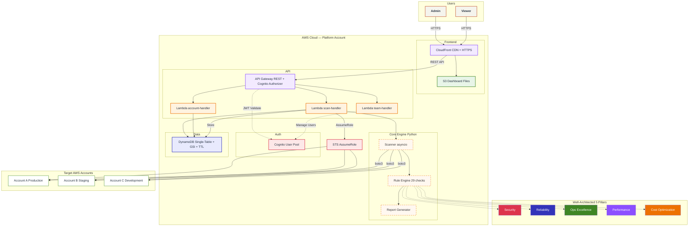
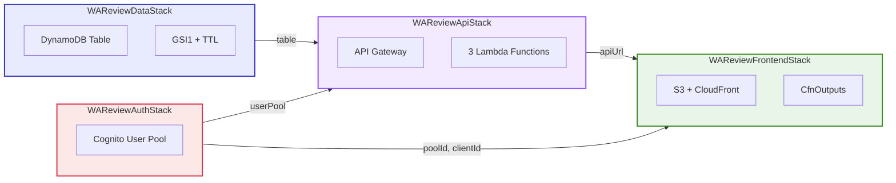
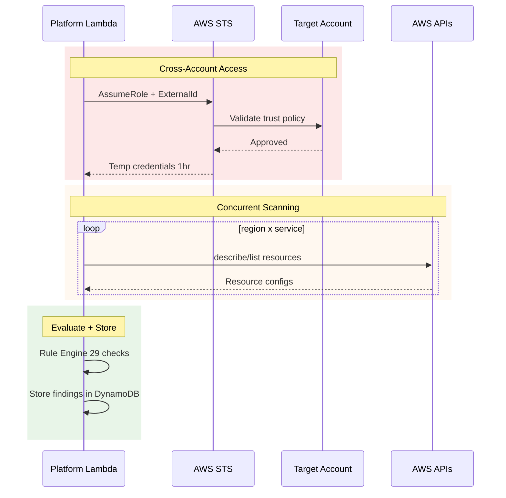
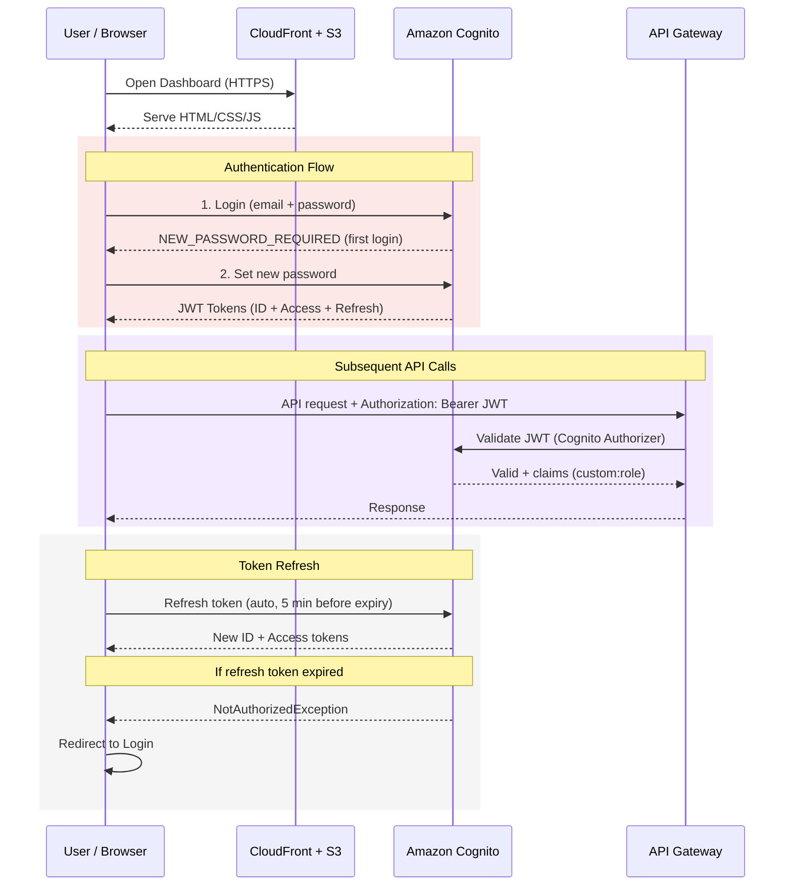
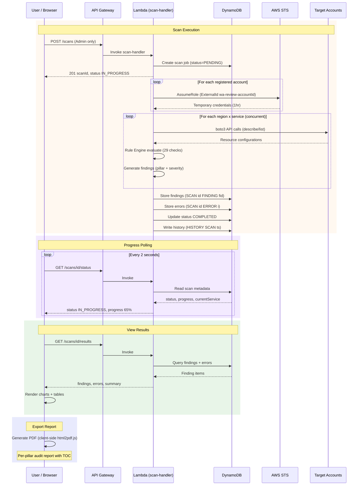
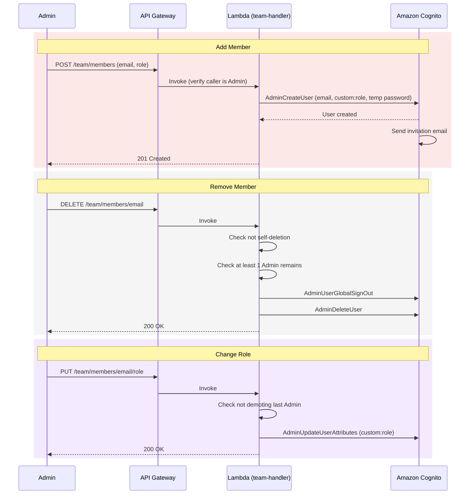
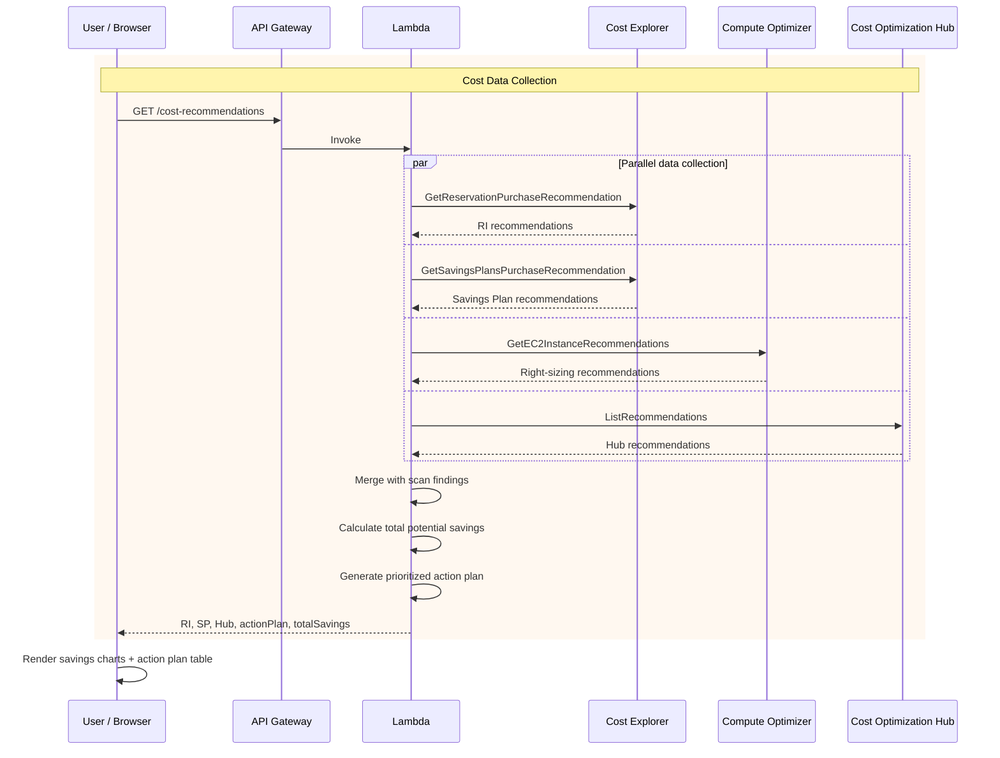

# AWS Well-Architected Review Tool

Automated platform for scanning and evaluating AWS environments against the 5 pillars of the AWS Well-Architected Framework.

---

## Quick Start — One Command Deployment

Open **AWS CloudShell** in the AWS account where you want to host the platform, then run:

**First time (new account):**
```bash
git clone https://github.com/konsudtai/com7wafr.git && cd com7wafr && chmod +x deploy.sh && ./deploy.sh --region ap-southeast-1 --admin-email admin@yourcompany.com
```

**Re-deploy (update existing):**
```bash
cd com7wafr && git pull && chmod +x deploy.sh && ./deploy.sh --region ap-southeast-1 --admin-email admin@yourcompany.com
```

**Re-deploy (clean install):**
```bash
rm -rf com7wafr && git clone https://github.com/konsudtai/com7wafr.git && cd com7wafr && chmod +x deploy.sh && ./deploy.sh --region ap-southeast-1 --admin-email admin@yourcompany.com
```

The script deploys the entire platform in approximately 10 minutes and outputs the Dashboard URL.

> Replace `admin@yourcompany.com` with the actual admin email. A temporary password will be sent to this email.
> Replace `ap-southeast-1` with your preferred AWS region.
> Each AWS account gets its own independent platform instance. You can deploy to multiple accounts.

**Destroy (remove all stacks safely):**
```bash
cd com7wafr && chmod +x deploy.sh && ./deploy.sh --destroy
```

> The destroy command removes only the WA Review platform stacks (wa-review-auth, wa-review-data, wa-review-api, wa-review-frontend). It does NOT affect any other workloads, services, or resources in the AWS account. Target accounts' IAM roles (WAReviewReadOnly) are not deleted — remove them manually if no longer needed.

---

## Table of Contents

1. [Project Overview](#1-project-overview)
2. [Architecture](#2-architecture)
3. [Technology Stack](#3-technology-stack)
4. [Features](#4-features)
5. [Supported AWS Services & Checks](#5-supported-aws-services--checks)
6. [Dashboard Pages](#6-dashboard-pages)
7. [Deployment Guide](#7-deployment-guide)
8. [Adding AWS Accounts](#8-adding-aws-accounts)
9. [CLI Usage](#9-cli-usage)
10. [Data Model & DynamoDB Design](#10-data-model--dynamodb-design)
11. [Authentication & Authorization](#11-authentication--authorization)
12. [Cost Estimate](#12-cost-estimate)
13. [Security Considerations](#13-security-considerations)
14. [Extending the Platform](#14-extending-the-platform)
15. [Testing](#15-testing)
16. [Project Structure](#16-project-structure)
17. [Destroying the Platform](#17-destroying-the-platform)
18. [Troubleshooting](#18-troubleshooting)

---

## 1. Project Overview

### Problem

Organizations running workloads on AWS need to regularly assess their environments against the AWS Well-Architected Framework. Manual reviews are time-consuming, inconsistent, and difficult to track over time across multiple accounts and regions.

### Solution

This tool automates the Well-Architected review process by scanning AWS resources via APIs, evaluating them against a plugin-based rule engine, and producing actionable findings categorized by pillar and severity. It operates in two modes:

- **CLI Mode** — Command-line tool for AWS CloudShell or local environments. Scans resources, evaluates against rules, generates HTML/JSON reports. Suitable for CI/CD pipelines and automation.
- **Web Dashboard Mode** — Serverless web application deployed on AWS (CloudFront + S3 + API Gateway + Lambda + DynamoDB + Cognito). Provides real-time scanning, interactive charts, team management, cost optimization recommendations, and audit-ready PDF reports.

### Design Decisions

| Decision | Rationale |
|----------|-----------|
| Python 3.9+ for core logic | Compatible with AWS CloudShell, boto3 ecosystem, service-screener-v2 patterns |
| asyncio + ThreadPoolExecutor | Concurrent scanning across regions/services/accounts; boto3 is synchronous |
| Plugin-based Rule Engine | Add checks via YAML + Python without modifying core code |
| Pydantic v2 | Data validation and serialization for all models |
| Vanilla HTML/CSS/JS dashboard | No build tools, no framework dependencies, deploy as static files directly |
| Chart.js via CDN | Charts without npm build step |
| DynamoDB single-table design | Low latency, low cost, serverless-native |
| Cognito User Pool | Managed auth with RBAC via custom attributes |
| AWS CloudFormation | Infrastructure as Code for all stacks |
| Read-only IAM roles | Least privilege for cross-account scanning |

---

## 2. Architecture

### Architecture Diagram

> Draw.io files: [architecture.drawio](docs/architecture.drawio) | [data-flow.drawio](docs/data-flow.drawio)



### CloudFormation Stacks



### Cross-Account Scanning



### Data Flow — Authentication



### Data Flow — Scan Lifecycle



### Data Flow — Team Management



### Data Flow — Cost Advisor



---

## 3. Technology Stack

## 3. Technology Stack

### Backend & Core

| Component | Technology | Purpose |
|-----------|-----------|---------|
| Core Logic | Python 3.9+ | Scanner, Rule Engine, Report Generator |
| Data Models | Pydantic v2 | Validation and serialization |
| AWS SDK | boto3 | AWS API calls |
| Concurrency | asyncio + ThreadPoolExecutor | Parallel scanning |
| Config Parsing | PyYAML + JSON | Configuration files |
| Lambda Handlers | TypeScript (Node.js 20) | API backend |
| AWS SDK (Lambda) | @aws-sdk v3 | DynamoDB, STS, Cognito operations |

### Frontend

| Component | Technology | Purpose |
|-----------|-----------|---------|
| Dashboard | Vanilla HTML/CSS/JS | No build tools required |
| Charts | Chart.js v4 (CDN) | Radar, doughnut, bar, line charts |
| PDF Export | html2pdf.js (CDN) | Client-side PDF generation |
| Authentication | amazon-cognito-identity-js (CDN) | Cognito login/token management (no MFA) |
| Design System | Custom CSS (Claude-inspired) | Warm parchment theme, dark/light mode |

### Infrastructure

| Component | Technology | Purpose |
|-----------|-----------|---------|
| IaC | AWS CloudFormation (YAML) | All infrastructure as code |
| Compute | AWS Lambda | Serverless API handlers |
| API | Amazon API Gateway | REST API with Cognito Authorizer |
| Database | Amazon DynamoDB | Single-table design, PAY_PER_REQUEST |
| Auth | Amazon Cognito | User Pool with RBAC |
| CDN | Amazon CloudFront | HTTPS, caching, SPA routing |
| Storage | Amazon S3 | Dashboard static files |
| Identity | AWS STS | Cross-account assume role |

### Testing

| Tool | Purpose |
|------|---------|
| pytest | Unit and integration tests |
| hypothesis | Property-based testing (100+ iterations) |
| moto | AWS service mocking |
| unittest.mock | General mocking |

---

## 4. Features

### Scanning
- Multi-region concurrent scanning
- Multi-account via STS AssumeRole
- Resource filtering by services and tags (AND logic)
- Configurable concurrency limit
- Error isolation (one failed task does not affect others)
- Automatic credential refresh

### Analysis
- 29 built-in checks across 10 AWS services
- Findings categorized by 5 Well-Architected pillars
- 5 severity levels: CRITICAL, HIGH, MEDIUM, LOW, INFORMATIONAL
- Suppression files to exclude known/accepted findings
- AWS Well-Architected Tool API integration

### Reporting
- Interactive HTML reports (self-contained, offline-viewable)
- JSON output (raw + full with summary)
- Audit-ready PDF reports organized by pillar
- Thai and English language support
- Table of Contents, control compliance status, sign-off section

### Cost Optimization
- Reserved Instance recommendations with purchase steps
- Savings Plan recommendations with purchase steps
- Compute Optimizer rightsizing (EC2, RDS, Lambda, EBS, ASG, ECS, Idle, License)
- Cost Optimization Hub integration
- Per-service optimization tips
- RI vs SP comparison guide
- Custom RI/SP calculator
- Prioritized action plan with estimated savings

### AI Agent (WA Agent)
- Chat-based AI assistant powered by Amazon Bedrock
- Model selection: Claude Sonnet 4.6, Claude Opus 4.6, Amazon Nova Lite 2.0
- Read tools: query findings, compliance, cost data, CloudTrail events, accounts
- Write tools: propose fix actions (S3 encryption, public access block, VPC flow logs, KMS rotation, CloudTrail config)
- Human-in-the-loop: all fix actions require explicit approval before execution
- Risk-level indicators (LOW/MEDIUM/HIGH) on proposed actions
- Thai and English language support

### Investigation
- CloudTrail event investigation via LookupEvents API
- Filter by account, region, time range, username, event name
- Auto-flag suspicious events (root activity, failed logins, IAM changes, security group changes)
- Summary stats: total events, alerts, warnings, errors, unique users/IPs

### Dashboard
- Real-time scan with progress bar
- Overview with radar chart, severity distribution, heatmap
- Filterable findings table with detail modal
- Scan history with trend charts
- Account management with auto-generated IAM setup scripts
- Team management (Admin/Viewer roles)
- Dark/light mode
- Responsive design

---

## 5. Supported AWS Services & Checks

| Service | Checks | Key Areas |
|---------|--------|-----------|
| EC2 | 5 | Unrestricted SSH, EBS encryption, monitoring, utilization, backup |
| S3 | 5 | Public access, encryption, versioning, logging, lifecycle |
| RDS | 3 | Multi-AZ, encryption at rest, automated backups |
| IAM | 3 | Root access keys, inline policies, MFA |
| Lambda | 3 | Memory optimization, dead letter queue, deprecated runtime |
| DynamoDB | 2 | Point-in-time recovery, KMS encryption |
| ELB | 2 | Access logging, HTTPS listener |
| CloudFront | 2 | HTTPS enforcement, WAF association |
| ECS | 2 | Circuit breaker, Container Insights |
| EKS | 2 | Control plane logging, public endpoint |

**Total: 29 checks** across Security, Reliability, Operational Excellence, Performance Efficiency, and Cost Optimization pillars.

---

## 6. Dashboard Pages

| Page | Description | Access |
|------|-------------|--------|
| Overview | Radar chart (pillar scores), severity KPIs, service x pillar heatmap, compliance summary, account cards | All |
| Findings | Filterable table (5 filters + search), detail drawer with resource, description, recommendation | All |
| Compliance | 7 frameworks (WAFS, CIS, NIST, SOC2, FTR, SPIP, SSB), click to expand Category → Rule ID detail (Service Screener style) | All |
| Investigate | CloudTrail event investigation — query by account, region, time range, username, event name. Auto-flags suspicious activity | Admin |
| History | Scan history table with status | All |
| Accounts | Account CRUD, 4-step wizard (Account Info → CloudShell Script → ARN → Verify & Save) | Admin: write, Viewer: read |
| Scan | Select accounts/regions/services with AWS icons, real-time progress bar | Admin only |
| Team | Add/remove members, change roles, self-deletion protection | Admin only |
| Report | Full preview with TOC, pillar analysis, all findings + remediation, compliance detail, cost overview. Thai/English toggle. PDF export | All |
| CloudFinOps | Actual spend, RI/SP recommendations with purchase steps, Compute Optimizer rightsizing (EC2/RDS/Lambda/EBS/ASG/ECS/Idle/License), per-service tips, RI vs SP guide, custom calculator | All |
| WA Agent | AI chat assistant (Claude Sonnet 4.6 / Opus 4.6 / Nova Lite 2.0) — ask questions, analyze findings, propose fixes with approval flow | All (execute: Admin) |

---

## 7. Deployment Guide

### Prerequisites

All pre-installed in AWS CloudShell:
- AWS CLI with configured credentials
- Git

Optional (for Lambda TypeScript build):
- Node.js 18+ and npm

### One-Command Deployment (CloudShell)

Open **AWS CloudShell** in the AWS account where you want to host the platform.

**First time (new account):**
```bash
git clone https://github.com/konsudtai/com7wafr.git && cd com7wafr && chmod +x deploy.sh && ./deploy.sh --region ap-southeast-1 --admin-email admin@yourcompany.com
```

**Re-deploy (update existing):**
```bash
cd com7wafr && git pull && chmod +x deploy.sh && ./deploy.sh --region ap-southeast-1 --admin-email admin@yourcompany.com
```

**Re-deploy (clean install):**
```bash
rm -rf com7wafr && git clone https://github.com/konsudtai/com7wafr.git && cd com7wafr && chmod +x deploy.sh && ./deploy.sh --region ap-southeast-1 --admin-email admin@yourcompany.com
```

### Deployment Options

```bash
# Basic deployment
./deploy.sh --region ap-southeast-1 --admin-email admin@company.com

# Specific region
./deploy.sh --region ap-southeast-1 --admin-email admin@company.com

# Specific AWS profile
./deploy.sh --profile production --region ap-southeast-1 --admin-email admin@company.com

# Tear down everything
./deploy.sh --destroy

# Help
./deploy.sh --help
```

| Option | Required | Description |
|--------|----------|-------------|
| `--admin-email EMAIL` | Yes | Admin email (temp password sent via email) |
| `--region REGION` | No | AWS region (default: from AWS config) |
| `--profile PROFILE` | No | AWS CLI profile name |
| `--destroy` | No | Remove all stacks and resources |

### What the Script Does

| Step | Action | Duration |
|------|--------|----------|
| 1 | Check prerequisites (AWS CLI only) | 5s |
| 2 | Build and upload Lambda code to S3 | 30s |
| 3 | Deploy 4 CloudFormation stacks | 5-8 min |
| 4 | Upload dashboard to S3, inject config | 15s |
| 5 | Invalidate CloudFront cache | 5s |
| 6 | Create initial admin user in Cognito | 5s |

### After Deployment

1. Open the Dashboard URL from the output
2. Check email for temporary password
3. Login and set a new password on first login (use the show/hide toggle to verify your password)
4. Go to **Accounts** page to add AWS accounts for scanning

### Enable AI Agent (WA Agent)

The AI Agent requires Amazon Bedrock model access. After deployment:

1. Go to **AWS Console** → **Amazon Bedrock** → **Model access** (in **us-east-1** region)
2. Click **Manage model access**
3. Enable: **Anthropic Claude Sonnet 4.6**, **Claude Opus 4.6**, **Amazon Nova Lite**
4. Click **Save changes** (approval is usually instant)

> Without this step, the WA Agent chat will return an access error. The platform itself works fine without AI — this is optional.

> Bedrock pricing: Claude Sonnet 4.6 ~$0.02/query, Nova Lite ~$0.001/query. See [Bedrock Pricing](https://aws.amazon.com/bedrock/pricing/).

### Updating

Pull latest code and re-deploy:

```bash
cd com7wafr && git pull && chmod +x deploy.sh && ./deploy.sh --region ap-southeast-1 --admin-email admin@yourcompany.com
```

Or update dashboard only:

```bash
aws s3 sync dashboard/ s3://BUCKET_NAME --exclude "node_modules/*" --exclude "src/*" --delete
aws cloudfront create-invalidation --distribution-id DIST_ID --paths "/*"
```

---

## 8. Adding AWS Accounts

### Automated Setup (Dashboard)

1. Go to **Accounts** page, click **+ Add Account**
2. Enter target Account ID and Alias
3. Click **Generate Setup Script**
4. Copy the script
5. Open **AWS CloudShell** in the **target account**
6. Paste and run the script
7. Return to Dashboard and click **Register Account**

### IAM Role Created

The script creates `WAReviewReadOnly` in the target account:

| Policy | Type | Permissions |
|--------|------|-------------|
| ReadOnlyAccess | AWS Managed | Read all resource configurations |
| SecurityAudit | AWS Managed | Security configuration audit |
| WAReviewAdditionalReadOnly | Inline | Well-Architected Tool, Cost Explorer (RI/SP recommendations), Cost Optimization Hub, Compute Optimizer, Trusted Advisor |

Trust policy:
- Principal: Platform account only
- Condition: External ID `wa-review-{targetAccountId}` (confused deputy protection)
- Max session: 1 hour

---

## 9. CLI Usage

```bash
# Install dependencies
pip install -r requirements.txt

# Basic scan
python -m cli.main --services ec2,s3

# Multi-region scan
python -m cli.main --regions us-east-1,ap-southeast-1 --services ec2,s3,rds

# Scan with config file
python -m cli.main --config config.yaml

# Tag filtering
python -m cli.main --regions us-east-1 --tags Environment=Production Team=Platform

# Account management
python -m cli.main add-account --account-id 123456789012 --role-arn arn:aws:iam::123456789012:role/WAReviewReadOnly --alias production
python -m cli.main list-accounts
python -m cli.main verify-account --account-id 123456789012
python -m cli.main remove-account --account-id 123456789012

# Help
python -m cli.main --help
```

| Exit Code | Meaning |
|-----------|---------|
| 0 | Success, no critical findings |
| 1 | Success, critical findings found |
| 2 | Execution error |

---

## 10. Data Model & DynamoDB Design

### Single-Table Design

Table: `wa-review-tool`, Billing: PAY_PER_REQUEST, TTL: `ttl`

| Entity | PK | SK |
|--------|----|----|
| Scan metadata | `SCAN#{scan_id}` | `META` |
| Scan finding | `SCAN#{scan_id}` | `FINDING#{finding_id}` |
| Scan error | `SCAN#{scan_id}` | `ERROR#{index}` |
| Account config | `ACCOUNT#{account_id}` | `META` |
| Scan history | `HISTORY` | `SCAN#{timestamp}#{scan_id}` |

GSI1: `GSI1PK` / `GSI1SK` for per-account scan history queries.

### Core Data Models (Pydantic v2)

| Model | Key Fields |
|-------|------------|
| Finding | finding_id, account_id, region, service, resource_id, check_id, pillar, severity, title, description, recommendation |
| Check | check_id, service, pillar, severity, evaluation_logic_ref, remediation_guidance |
| ScanConfiguration | regions, services, tags, concurrency_limit, suppression_file |
| ScanResult | scan_id, status, findings, suppressed_findings, errors, resources_scanned |
| AccountConfiguration | account_id, role_arn, alias, last_connection_status |
| TeamMember | email, role (Admin/Viewer), status, joined_at |

---

## 11. Authentication & Authorization

### Cognito Configuration

| Setting | Value |
|---------|-------|
| Self Sign-Up | Disabled (Admin creates users) |
| Sign-In | Email |
| Password Policy | Min 8, uppercase, lowercase, digits, symbols |
| Token Validity | ID/Access: 1 hour, Refresh: 30 days |
| User Existence Errors | Prevented (no user enumeration) |
| Custom Attributes | `custom:role` (Admin / Viewer) |

### Authorization Matrix

| Endpoint | Admin | Viewer |
|----------|-------|--------|
| GET /scans, /scans/* | Yes | Yes |
| POST /scans | Yes | No |
| GET /accounts | Yes | Yes |
| POST/PUT/DELETE /accounts/* | Yes | No |
| ALL /team/* | Yes | No |

### Error Handling

- Login failure: Generic message "อีเมลหรือรหัสผ่านไม่ถูกต้อง" (never reveals which field)
- Token expired: Auto-refresh via refresh token
- Refresh token expired: Redirect to login
- Unauthorized: 403 Forbidden

---

## 12. Cost Estimate

### Monthly Cost (Typical Usage)

Assumptions: 3 accounts, 10 services, daily scans, 5 team members, ap-southeast-1 region.

| Service | Usage | Estimated Cost |
|---------|-------|---------------|
| **Lambda** | ~900 invocations/mo, 512MB, avg 15s | $0.20 |
| **API Gateway** | ~3,000 requests/mo | $0.01 |
| **DynamoDB** | ~5,000 writes + 15,000 reads/mo (on-demand) | $0.02 |
| **S3** | ~50 MB dashboard + Lambda code | $0.01 |
| **CloudFront** | ~10 GB transfer/mo | $0.85 |
| **Cognito** | 5 MAU (first 50,000 free) | $0.00 |
| **STS** | ~900 AssumeRole calls/mo | $0.00 |
| **CloudWatch Logs** | ~1 GB/mo | $0.50 |
| **WAF** | 1 Web ACL + 2 rules | $6.00 |
| **Bedrock (AI Agent)** | ~50 queries/day (Sonnet 4.6) | $0-30 (usage-based) |
| | | |
| **Total** | | **~$7.59 + AI usage** |

> WAF is the largest fixed cost. Bedrock AI is pay-per-use only — $0 if not used.

### Cost at Scale

| Scale | Accounts | Daily Scans | Est. Monthly Cost |
|-------|----------|-------------|-------------------|
| Small | 1-5 | 1 | $7-10 |
| Medium | 10-20 | 2 | $12-25 |
| Large | 50-100 | 4 | $35-90 |

### Free Tier Coverage (First 12 Months)

| Service | Free Tier | Platform Usage | Covered? |
|---------|-----------|----------------|----------|
| Lambda | 1M requests + 400K GB-s | ~900 req + ~7K GB-s | Yes |
| DynamoDB | 25 WCU + 25 RCU | On-demand ~$0.02 | Yes |
| API Gateway | 1M calls | ~3K calls | Yes |
| S3 | 5 GB + 20K GET | ~50 MB | Yes |
| CloudFront | 1 TB transfer | ~10 GB | Yes |
| Cognito | 50,000 MAU | 5 users | Yes |
| WAF | Not included in Free Tier | $6/mo | No |

**Estimated cost during Free Tier: ~$6/mo** (WAF only). Without WAF: **$0/mo**.

### Cost When Platform is Idle (No Scans)

If no scans are running and no users are active:

| Service | Idle Cost |
|---------|-----------|
| Lambda | $0 (no invocations) |
| API Gateway | $0 (no requests) |
| DynamoDB | $0 (on-demand, no reads/writes) |
| S3 | $0.001 (storage only) |
| CloudFront | $0 (no traffic) |
| WAF | $6.00 (fixed monthly) |
| Bedrock | $0 (no queries) |
| **Total idle** | **~$6/mo** |

---

## 13. Security Considerations

| Area | Implementation |
|------|---------------|
| Cross-account access | Read-only IAM roles with External ID |
| Authentication | Cognito User Pool, no self-signup |
| Authorization | JWT validation via Cognito Authorizer on API Gateway |
| Error messages | Generic (never reveal email/password specifics) |
| User enumeration | Prevented via Cognito `preventUserExistenceErrors` |
| Data in transit | HTTPS enforced via CloudFront |
| Data at rest | DynamoDB encryption (AWS managed) |
| S3 access | Block all public access, OAC for CloudFront |
| Admin protection | Cannot self-delete, minimum 1 admin enforced |
| Supply chain | Dashboard uses no npm at runtime (CDN only) |
| IAM | Least privilege, no wildcard permissions on platform |

---

## 14. Extending the Platform

### Adding a New Check

1. Create YAML in `checks/{service}/checks.yaml`:

```yaml
checks:
  - check_id: ec2-006
    service: ec2
    description: EC2 instance should have IMDSv2 enforced
    pillar: security
    severity: HIGH
    evaluation_logic_ref: "checks.ec2:check_imdsv2"
    remediation_guidance: Set HttpTokens to required in instance metadata options
    documentation_url: https://docs.aws.amazon.com/AWSEC2/latest/UserGuide/configuring-instance-metadata-service.html
```

2. Add function in `checks/{service}/__init__.py`:

```python
def check_imdsv2(resource):
    """Returns True if PASSES (IMDSv2 enforced)."""
    metadata = resource.configuration.get("metadata_options", {})
    return metadata.get("http_tokens") == "required"
```

No core code changes needed.

### Adding a New Service

1. Create `checks/{service}/` directory with `__init__.py` and `checks.yaml`
2. Add scanner method in `core/scanner.py` (`_scan_{service}`)
3. Register in `_build_service_scanners()`

---

## 15. Testing

```bash
# Install test dependencies
pip install -r requirements.txt

# Run all tests
pytest

# With coverage
pytest --cov

# Specific test file
pytest tests/test_rule_engine.py

# Property-based tests only
pytest -k "roundtrip or invariant or correctness"
```

### Test Coverage

| Area | Tests | Type |
|------|-------|------|
| Config Parser | 27 | Unit (pytest) |
| Account Manager | 28 | Unit (mock STS) |
| Rule Engine | 29 | Unit (YAML + evaluators) |
| Scanner | 15 | Unit + Integration (mock) |
| STS Client | 10 | Unit (mock) |
| Report Generator | 20 | Unit (file output) |
| Auth Module | 42 | Unit (authorization matrix) |
| File Storage | 18 | Unit (JSON/YAML round-trip) |
| DynamoDB Storage | 11 | Integration (moto) |

### Property-Based Tests (Hypothesis)

19 correctness properties validated with 100+ random iterations each, covering serialization round-trips, tag filtering AND logic, suppression matching, error isolation, config merge precedence, exit codes, ARN validation, account uniqueness, role authorization, and admin count invariants.

---

## 16. Project Structure

```
.
├── deploy.sh                # One-command deployment script
├── README.md
├── .gitignore
├── requirements.txt         # Python dependencies
├── pyproject.toml
│
├── dashboard/               # Web Dashboard (vanilla HTML/CSS/JS)
│   ├── index.html           # SPA shell (top nav, command palette, tweaks)
│   ├── css/style.css        # Design system (Instrument Serif + Inter Tight)
│   └── js/
│       ├── config.js        # Auto-generated (API URL, Cognito IDs)
│       ├── auth.js          # Cognito auth (login, token refresh, logout)
│       ├── api.js           # API client with JWT
│       ├── data.js          # Data layer (loads from API, derives pillars/frameworks)
│       ├── pages.js         # All 9 pages (overview, findings, compliance, etc.)
│       └── app.js           # Router, nav, avatar menu, page wiring, PDF gen
│
├── backend/                 # Lambda handlers (TypeScript)
│   ├── auth/auth-module.ts  # Role extraction, authorization
│   ├── handlers/
│   │   ├── scan-handler.ts  # Scan + Investigate endpoints
│   │   ├── account-handler.ts
│   │   ├── team-handler.ts
│   │   └── ai-handler.ts   # WA Agent (Bedrock AI chat + fix execution)
│   ├── package.json
│   └── tsconfig.json
│
├── cfn/                     # CloudFormation templates (YAML)
│   ├── auth.yaml            # Cognito User Pool
│   ├── data.yaml            # DynamoDB table
│   ├── api.yaml             # API Gateway + Lambda + WAF
│   └── frontend.yaml        # S3 + CloudFront
│
├── core/                    # Python core (shared CLI + backend)
│   ├── models.py            # Pydantic v2 data models
│   ├── scanner.py           # Concurrent resource scanning
│   ├── rule_engine.py       # Check evaluation engine
│   ├── report_generator.py  # HTML/JSON reports
│   ├── account_manager.py   # Account CRUD + DynamoDB storage
│   ├── config_parser.py     # JSON/YAML config parsing
│   ├── sts_client.py        # STS assume role + credential cache
│   └── wa_integration.py    # Well-Architected Tool API
│
├── checks/                  # Check definitions (plugin-based)
│   ├── ec2/                 # 5 checks + evaluation functions
│   ├── s3/                  # 5 checks
│   ├── rds/                 # 3 checks
│   ├── iam/                 # 3 checks
│   ├── lambda_/             # 3 checks
│   ├── dynamodb/            # 2 checks
│   ├── elb/                 # 2 checks
│   ├── cloudfront/          # 2 checks
│   ├── ecs/                 # 2 checks
│   └── eks/                 # 2 checks
│
├── cli/main.py              # CLI entry point
├── tests/                   # pytest + hypothesis tests
└── installer/install.sh     # CloudShell installer (CLI only)
```

---

## 17. Destroying the Platform

### Safe Removal

The destroy command removes **only** WA Review platform resources. It does NOT touch:
- Other CloudFormation stacks in the account
- EC2 instances, RDS databases, or any production workloads
- IAM roles in target accounts (WAReviewReadOnly) — remove manually if needed
- CloudWatch log groups — retained for audit trail (delete manually if desired)

```bash
# Remove all WA Review stacks
./deploy.sh --destroy

# Or with specific profile/region
./deploy.sh --destroy --profile production --region ap-southeast-1
```

### What Gets Deleted

| Stack | Resources Removed |
|-------|-------------------|
| wa-review-api | API Gateway, 3 Lambda functions, IAM role, WAF |
| wa-review-frontend | S3 bucket (dashboard files), CloudFront distribution |
| wa-review-auth | Cognito User Pool (all users deleted) |
| wa-review-data | DynamoDB table (all scan data deleted) |

### Manual Cleanup (Optional)

```bash
# Remove Lambda code S3 bucket
aws s3 rb s3://wa-review-lambda-ACCOUNT_ID-REGION --force

# Remove CloudWatch log groups
aws logs delete-log-group --log-group-name /aws/lambda/wa-review-scan-handler
aws logs delete-log-group --log-group-name /aws/lambda/wa-review-account-handler
aws logs delete-log-group --log-group-name /aws/lambda/wa-review-team-handler

# Remove IAM role from target accounts (run in each target account)
aws iam detach-role-policy --role-name WAReviewReadOnly --policy-arn arn:aws:iam::aws:policy/ReadOnlyAccess
aws iam detach-role-policy --role-name WAReviewReadOnly --policy-arn arn:aws:iam::aws:policy/AWSBillingReadOnlyAccess
aws iam delete-role --role-name WAReviewReadOnly
```

---

## 18. Troubleshooting

| Issue | Solution |
|-------|----------|
| `cdk bootstrap` fails | Not needed — uses CloudFormation directly |
| CloudShell disk full | Run `rm -rf /tmp/* ~/.npm/_cacache` then retry |
| Lambda timeout on large scans | Reduce `concurrency_limit` or scan fewer services/regions per run |
| Cognito "User already exists" | The admin user was already created; check email for temp password |
| Dashboard shows login but API fails | Check `dashboard/js/config.js` has correct API URL and Cognito IDs |
| Cross-account assume role fails | Verify the IAM role exists in target account and trust policy includes platform account |
| PDF export blank | Ensure html2pdf.js CDN is accessible; check browser console for errors |
| Dark mode not persisting | Clear localStorage: `localStorage.removeItem('wa-theme')` |

### Useful Commands

```bash
# Check deployment outputs
cat deployment-outputs.txt

# View stack status
aws cloudformation describe-stacks --query "Stacks[?starts_with(StackName,'wa-review')].{Name:StackName,Status:StackStatus}" --output table

# View Lambda logs
aws logs tail /aws/lambda/wa-review-scan-handler --follow

# Re-deploy dashboard only
aws s3 sync dashboard/ s3://$(grep S3_BUCKET deployment-outputs.txt | cut -d= -f2) --exclude "node_modules/*" --delete

# Destroy everything
./deploy.sh --destroy
```

---

## License

Copyright (c) 2024 Com7 Public Company Limited (Com7 Business). All rights reserved.

This software is proprietary and licensed exclusively to Com7 Business customers with a valid service agreement. Unauthorized use, reproduction, or distribution is prohibited. See [LICENSE](LICENSE) for full terms.
